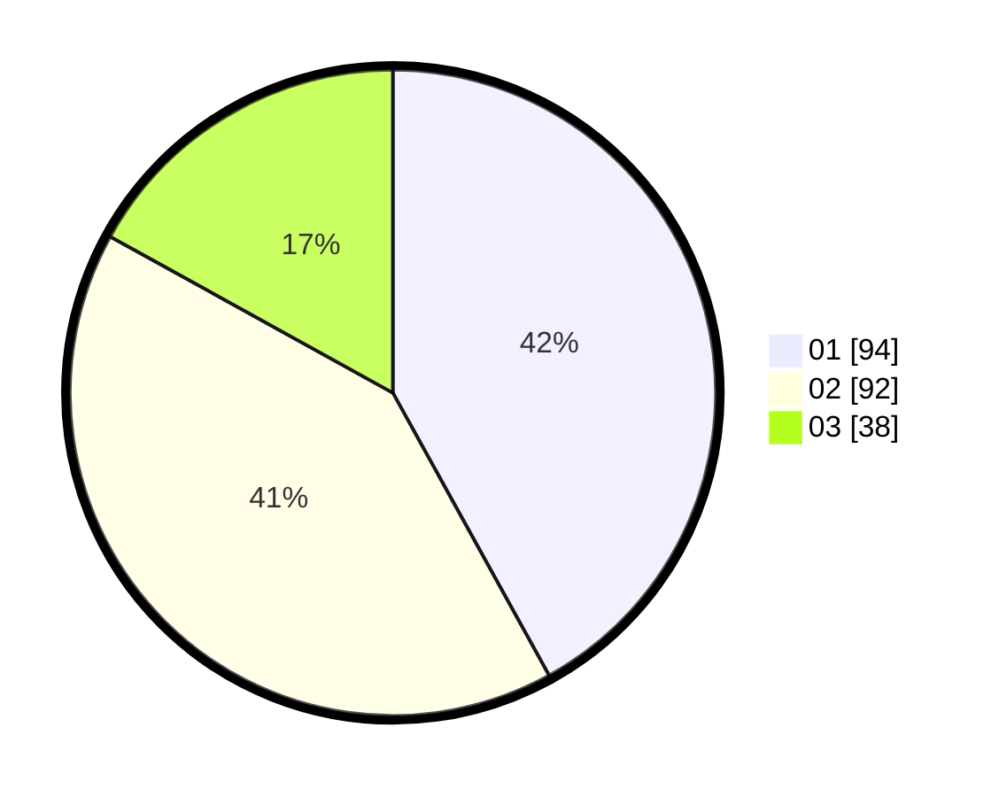

# Hasil

Hasil perolehan suara paslon dapat dilihat pada file paslon-01.txt, paslon-02.txt, dan paslon-03.txt.

Jika tidak ada, artinya data tersebut belum ada pada SIREKAP.

## Perolehan Suara

 * Paslon 01: **94**.
 * Paslon 02: **92**.
 * Paslon 03: **38**.

## Foto C Plano

https://sirekap-obj-formc.kpu.go.id/4e01/pemilu/ppwp/31/75/03/10/06/3175031006176-20240217-184932--29055418-2b97-4211-922c-fed717361e4f.jpg

https://sirekap-obj-formc.kpu.go.id/4e01/pemilu/ppwp/31/75/03/10/06/3175031006176-20240214-232757--008fc8ae-de4d-4d21-980e-bd841bd41d4a.jpg

https://sirekap-obj-formc.kpu.go.id/4e01/pemilu/ppwp/31/75/03/10/06/3175031006176-20240214-233008--85c1c3d1-07a6-4fea-93ad-39297d04292d.jpg
