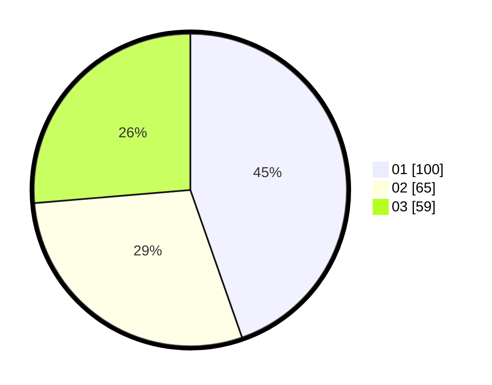

# Hasil

Hasil perolehan suara paslon dapat dilihat pada file paslon-01.txt, paslon-02.txt, dan paslon-03.txt.

Jika tidak ada, artinya data tersebut belum ada pada SIREKAP.

## Perolehan Suara

 * Paslon 01: **100**.
 * Paslon 02: **65**.
 * Paslon 03: **59**.

## Foto C Plano

https://sirekap-obj-formc.kpu.go.id/4779/pemilu/ppwp/31/75/03/10/06/3175031006178-20240218-223346--dec96ed3-ef7d-464a-867c-5029cef2ccd5.jpg

https://sirekap-obj-formc.kpu.go.id/4779/pemilu/ppwp/31/75/03/10/06/3175031006178-20240218-223348--e7ebee2f-6f91-4913-99b7-81ee90f01eca.jpg

https://sirekap-obj-formc.kpu.go.id/4779/pemilu/ppwp/31/75/03/10/06/3175031006178-20240218-223347--3d2b48f4-83ab-4ac6-b641-7483acfa79b5.jpg

## DATA PEMILIH TETAP

Jumlah pemilih dalam DPT: **232**.
 * L: **112**.
 * P: **120**.

## DATA PENGGUNA HAK PILIH

Jumlah pengguna hak pilih dalam DPT: **201**.
 * L: **95**.
 * P: **106**.

Jumlah pengguna hak pilih dalam DPTb: **13**.
 * L: **9**.
 * P: **4**.

Jumlah pengguna hak pilih dalam DPK: **13**.
 * L: **5**.
 * P: **8**.

Jumlah pengguna hak pilih: **227**.
 * L: **109**.
 * P: **118**.

## JUMLAH SUARA SAH DAN TIDAK SAH

JUMLAH SELURUH SUARA SAH: **224**.

JUMLAH SUARA TIDAK SAH: **3**.

JUMLAH SELURUH SUARA SAH DAN SUARA TIDAK SAH: **227**.
