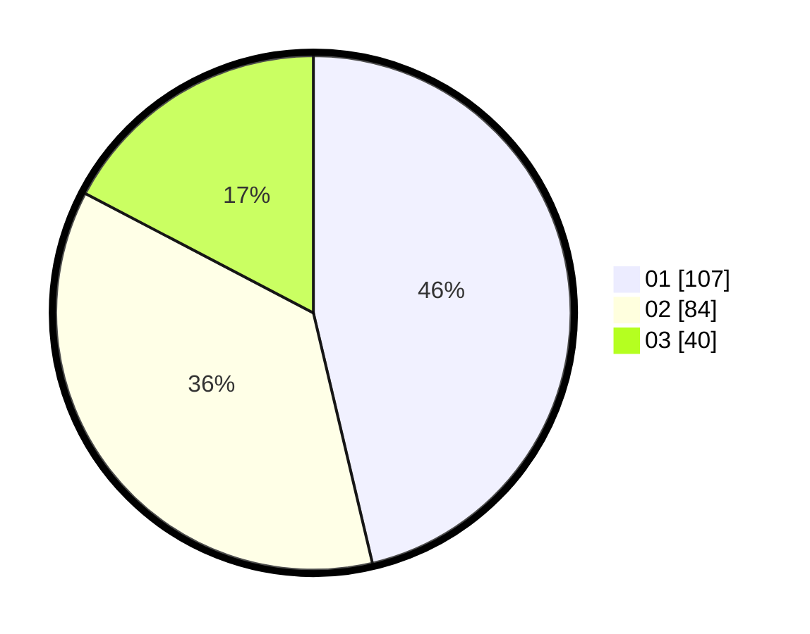

# Hasil

Hasil perolehan suara paslon dapat dilihat pada file paslon-01.txt, paslon-02.txt, dan paslon-03.txt.

Jika tidak ada, artinya data tersebut belum ada pada SIREKAP.

## Perolehan Suara

 * Paslon 01: **107**.
 * Paslon 02: **84**.
 * Paslon 03: **40**.

## Foto C Plano

https://sirekap-obj-formc.kpu.go.id/12b7/pemilu/ppwp/31/75/03/10/07/3175031007002-20240217-121951--2250c8ad-c44d-46ae-88ff-2452df1fa102.jpg

https://sirekap-obj-formc.kpu.go.id/12b7/pemilu/ppwp/31/75/03/10/07/3175031007002-20240214-210744--d0abf9d3-8e77-4628-b28c-36202f90bc18.jpg

https://sirekap-obj-formc.kpu.go.id/12b7/pemilu/ppwp/31/75/03/10/07/3175031007002-20240214-210921--eac8f009-5539-4d27-9ebd-fbb02536dd1a.jpg
