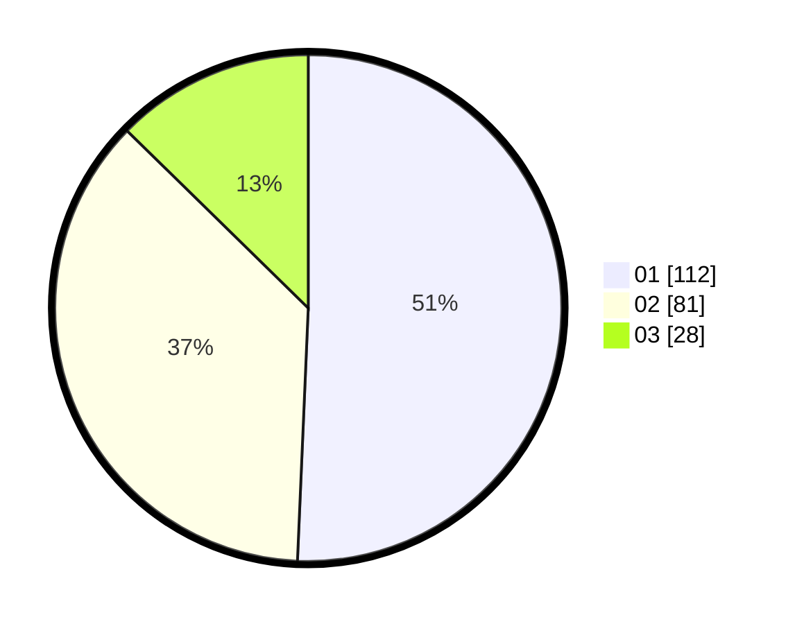

# Hasil

Hasil perolehan suara paslon dapat dilihat pada file paslon-01.txt, paslon-02.txt, dan paslon-03.txt.

Jika tidak ada, artinya data tersebut belum ada pada SIREKAP.

## Perolehan Suara

 * Paslon 01: **112**.
 * Paslon 02: **81**.
 * Paslon 03: **28**.

## Foto C Plano

https://sirekap-obj-formc.kpu.go.id/0c37/pemilu/ppwp/31/75/03/10/07/3175031007004-20240214-155030--d08e020a-245e-4d5d-9c05-72aff20924ca.jpg

https://sirekap-obj-formc.kpu.go.id/0c37/pemilu/ppwp/31/75/03/10/07/3175031007004-20240214-155155--72effdbf-67c5-47ef-918c-7e1cf7ea9f50.jpg

https://sirekap-obj-formc.kpu.go.id/0c37/pemilu/ppwp/31/75/03/10/07/3175031007004-20240214-155308--9954aa5c-1c61-49f1-b9ed-b342d5b15471.jpg

## DATA PEMILIH TETAP

Jumlah pemilih dalam DPT: **276**.
 * L: **145**.
 * P: **131**.

## DATA PENGGUNA HAK PILIH

Jumlah pengguna hak pilih dalam DPT: **220**.
 * L: **112**.
 * P: **108**.

Jumlah pengguna hak pilih dalam DPTb: **6**.
 * L: **5**.
 * P: **1**.

Jumlah pengguna hak pilih dalam DPK: **0**.
 * L: **0**.
 * P: **0**.

Jumlah pengguna hak pilih: **226**.
 * L: **117**.
 * P: **109**.

## JUMLAH SUARA SAH DAN TIDAK SAH

JUMLAH SELURUH SUARA SAH: **221**.

JUMLAH SUARA TIDAK SAH: **5**.

JUMLAH SELURUH SUARA SAH DAN SUARA TIDAK SAH: **226**.
