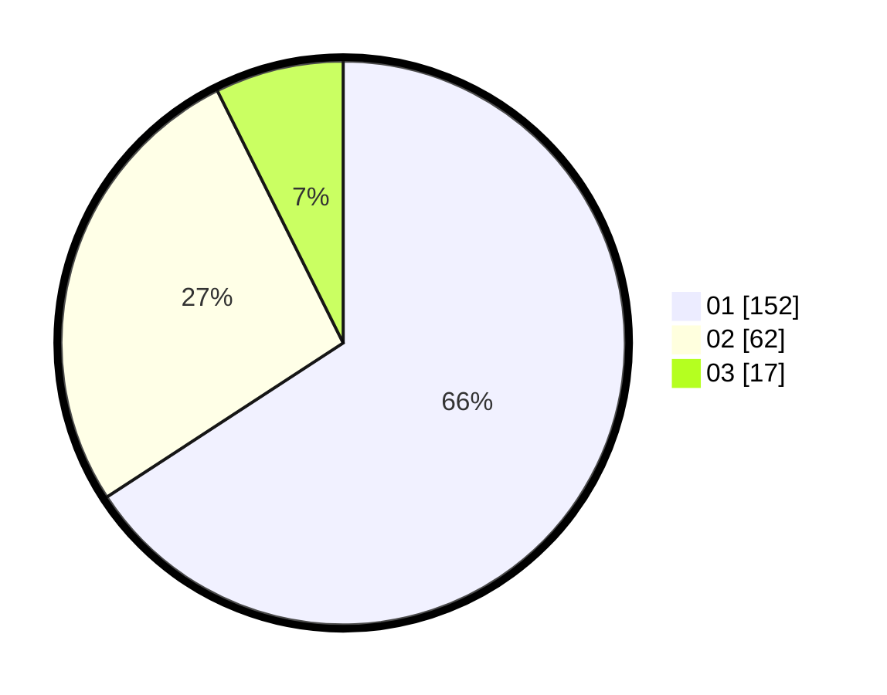

# Hasil

Hasil perolehan suara paslon dapat dilihat pada file paslon-01.txt, paslon-02.txt, dan paslon-03.txt.

Jika tidak ada, artinya data tersebut belum ada pada SIREKAP.

## Perolehan Suara

 * Paslon 01: **152**.
 * Paslon 02: **62**.
 * Paslon 03: **17**.

## Foto C Plano

https://sirekap-obj-formc.kpu.go.id/2ee7/pemilu/ppwp/31/75/03/10/07/3175031007006-20240214-192915--faef901d-a9e0-4553-a93b-ad6a6f67e8e0.jpg

https://sirekap-obj-formc.kpu.go.id/2ee7/pemilu/ppwp/31/75/03/10/07/3175031007006-20240214-205615--712210e0-4391-49f9-8092-7ef2477d1246.jpg

https://sirekap-obj-formc.kpu.go.id/2ee7/pemilu/ppwp/31/75/03/10/07/3175031007006-20240215-020842--48896ab7-0c28-4951-8496-4dd229d03cf8.jpg
