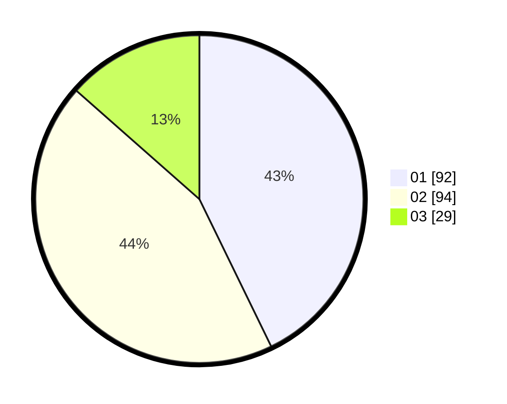

# Hasil

Hasil perolehan suara paslon dapat dilihat pada file paslon-01.txt, paslon-02.txt, dan paslon-03.txt.

Jika tidak ada, artinya data tersebut belum ada pada SIREKAP.

## Perolehan Suara

 * Paslon 01: **92**.
 * Paslon 02: **94**.
 * Paslon 03: **29**.

## Foto C Plano

https://sirekap-obj-formc.kpu.go.id/3634/pemilu/ppwp/31/75/03/10/07/3175031007012-20240214-221524--bad3d815-ec5f-4256-858d-9f9ad0fafa4a.jpg

https://sirekap-obj-formc.kpu.go.id/3634/pemilu/ppwp/31/75/03/10/07/3175031007012-20240214-221639--7515ddf5-c03a-4939-a7c5-914b2a5577e1.jpg

https://sirekap-obj-formc.kpu.go.id/3634/pemilu/ppwp/31/75/03/10/07/3175031007012-20240214-221821--710d54ea-43e0-4dbe-8aa6-2d280d9cb505.jpg

## DATA PEMILIH TETAP

Jumlah pemilih dalam DPT: **284**.
 * L: **157**.
 * P: **127**.

## DATA PENGGUNA HAK PILIH

Jumlah pengguna hak pilih dalam DPT: **219**.
 * L: **109**.
 * P: **110**.

Jumlah pengguna hak pilih dalam DPTb: **0**.
 * L: **0**.
 * P: **0**.

Jumlah pengguna hak pilih dalam DPK: **0**.
 * L: **0**.
 * P: **0**.

Jumlah pengguna hak pilih: **219**.
 * L: **109**.
 * P: **110**.

## JUMLAH SUARA SAH DAN TIDAK SAH

JUMLAH SELURUH SUARA SAH: **215**.

JUMLAH SUARA TIDAK SAH: **4**.

JUMLAH SELURUH SUARA SAH DAN SUARA TIDAK SAH: **219**.
