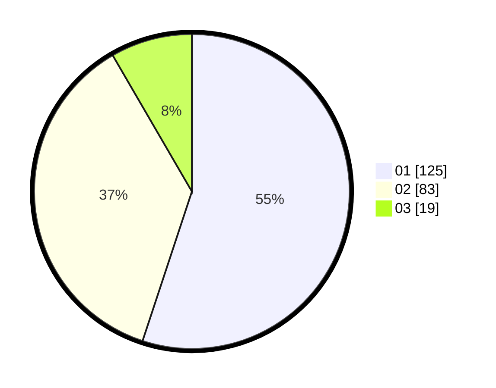

# Hasil

Hasil perolehan suara paslon dapat dilihat pada file paslon-01.txt, paslon-02.txt, dan paslon-03.txt.

Jika tidak ada, artinya data tersebut belum ada pada SIREKAP.

## Perolehan Suara

 * Paslon 01: **125**.
 * Paslon 02: **83**.
 * Paslon 03: **19**.

## Foto C Plano

https://sirekap-obj-formc.kpu.go.id/b391/pemilu/ppwp/31/75/03/10/07/3175031007013-20240214-194022--de9772fc-40e3-4448-b8f1-35b96c4f86a4.jpg

https://sirekap-obj-formc.kpu.go.id/b391/pemilu/ppwp/31/75/03/10/07/3175031007013-20240214-155105--2dd6d219-b027-4867-9064-8018975c04fb.jpg

https://sirekap-obj-formc.kpu.go.id/b391/pemilu/ppwp/31/75/03/10/07/3175031007013-20240214-155229--a65684ca-b18b-4a3c-9faa-273f55056ebd.jpg

## DATA PEMILIH TETAP

Jumlah pemilih dalam DPT: **282**.
 * L: **142**.
 * P: **140**.

## DATA PENGGUNA HAK PILIH

Jumlah pengguna hak pilih dalam DPT: **224**.
 * L: **108**.
 * P: **116**.

Jumlah pengguna hak pilih dalam DPTb: **3**.
 * L: **1**.
 * P: **2**.

Jumlah pengguna hak pilih dalam DPK: **0**.
 * L: **0**.
 * P: **0**.

Jumlah pengguna hak pilih: **227**.
 * L: **109**.
 * P: **118**.

## JUMLAH SUARA SAH DAN TIDAK SAH

JUMLAH SELURUH SUARA SAH: **227**.

JUMLAH SUARA TIDAK SAH: **0**.

JUMLAH SELURUH SUARA SAH DAN SUARA TIDAK SAH: **227**.
