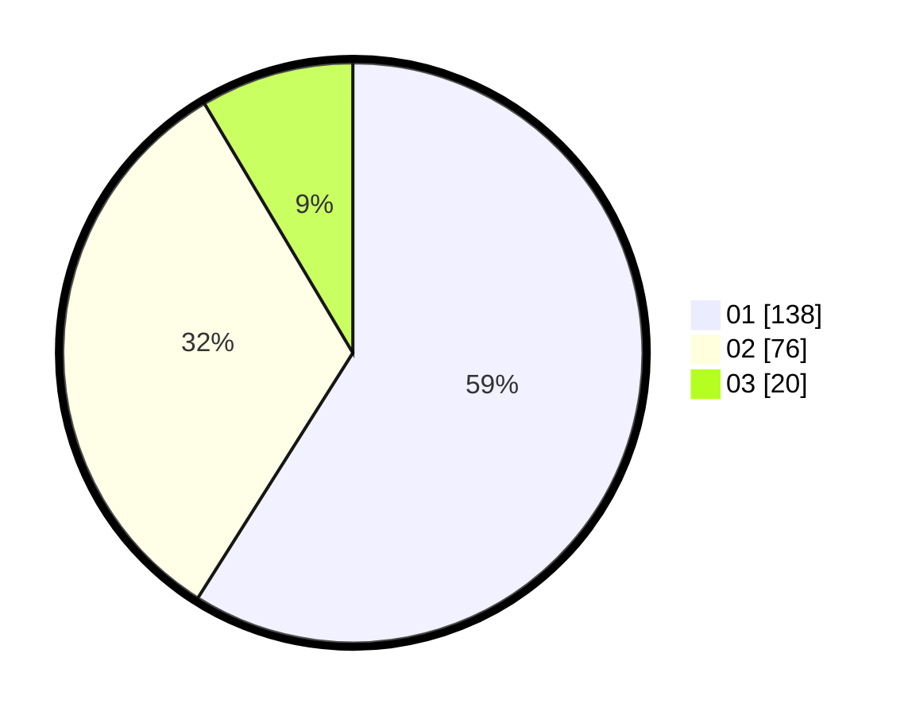

# Hasil

Hasil perolehan suara paslon dapat dilihat pada file paslon-01.txt, paslon-02.txt, dan paslon-03.txt.

Jika tidak ada, artinya data tersebut belum ada pada SIREKAP.

## Perolehan Suara

 * Paslon 01: **138**.
 * Paslon 02: **76**.
 * Paslon 03: **20**.

## Foto C Plano

https://sirekap-obj-formc.kpu.go.id/7373/pemilu/ppwp/31/75/03/10/07/3175031007014-20240214-195332--aa64e949-840b-4703-877a-a89a6a33df4d.jpg

https://sirekap-obj-formc.kpu.go.id/7373/pemilu/ppwp/31/75/03/10/07/3175031007014-20240214-195336--04c3b0ef-2786-49a8-936d-8b52e25b2fd3.jpg

https://sirekap-obj-formc.kpu.go.id/7373/pemilu/ppwp/31/75/03/10/07/3175031007014-20240214-195338--6849fec5-bc24-4344-b918-589528432b9c.jpg

## DATA PEMILIH TETAP

Jumlah pemilih dalam DPT: **283**.
 * L: **143**.
 * P: **140**.

## DATA PENGGUNA HAK PILIH

Jumlah pengguna hak pilih dalam DPT: **233**.
 * L: **121**.
 * P: **112**.

Jumlah pengguna hak pilih dalam DPTb: **0**.
 * L: **0**.
 * P: **0**.

Jumlah pengguna hak pilih dalam DPK: **5**.
 * L: **3**.
 * P: **2**.

Jumlah pengguna hak pilih: **238**.
 * L: **124**.
 * P: **114**.

## JUMLAH SUARA SAH DAN TIDAK SAH

JUMLAH SELURUH SUARA SAH: **234**.

JUMLAH SUARA TIDAK SAH: **4**.

JUMLAH SELURUH SUARA SAH DAN SUARA TIDAK SAH: **238**.
