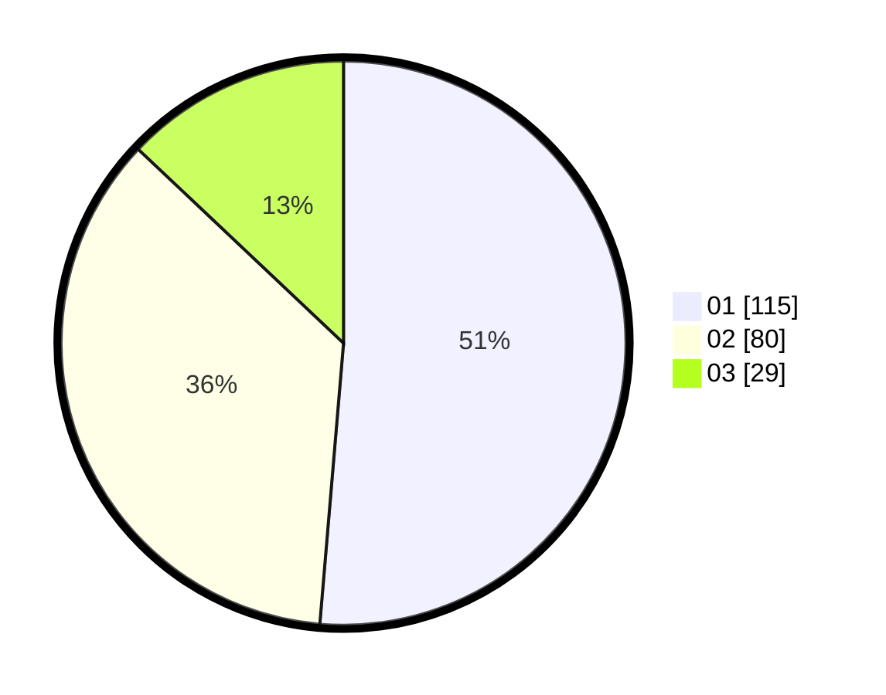

# Hasil

Hasil perolehan suara paslon dapat dilihat pada file paslon-01.txt, paslon-02.txt, dan paslon-03.txt.

Jika tidak ada, artinya data tersebut belum ada pada SIREKAP.

## Perolehan Suara

 * Paslon 01: **115**.
 * Paslon 02: **80**.
 * Paslon 03: **29**.

## Foto C Plano

https://sirekap-obj-formc.kpu.go.id/3dcc/pemilu/ppwp/31/75/03/10/07/3175031007016-20240216-075332--c611b641-03c9-45aa-8233-71b2767f0a56.jpg

https://sirekap-obj-formc.kpu.go.id/3dcc/pemilu/ppwp/31/75/03/10/07/3175031007016-20240216-083134--fa8c2f2c-2bb6-49a9-ab62-3ad661f74ab5.jpg

https://sirekap-obj-formc.kpu.go.id/3dcc/pemilu/ppwp/31/75/03/10/07/3175031007016-20240216-083441--eea0aa76-79c5-44d3-9a0b-791fa44a12b7.jpg

## DATA PEMILIH TETAP

Jumlah pemilih dalam DPT: **280**.
 * L: **135**.
 * P: **145**.

## DATA PENGGUNA HAK PILIH

Jumlah pengguna hak pilih dalam DPT: **227**.
 * L: **112**.
 * P: **115**.

Jumlah pengguna hak pilih dalam DPTb: **0**.
 * L: **0**.
 * P: **0**.

Jumlah pengguna hak pilih dalam DPK: **1**.
 * L: **1**.
 * P: **0**.

Jumlah pengguna hak pilih: **228**.
 * L: **113**.
 * P: **115**.

## JUMLAH SUARA SAH DAN TIDAK SAH

JUMLAH SELURUH SUARA SAH: **224**.

JUMLAH SUARA TIDAK SAH: **4**.

JUMLAH SELURUH SUARA SAH DAN SUARA TIDAK SAH: **228**.
