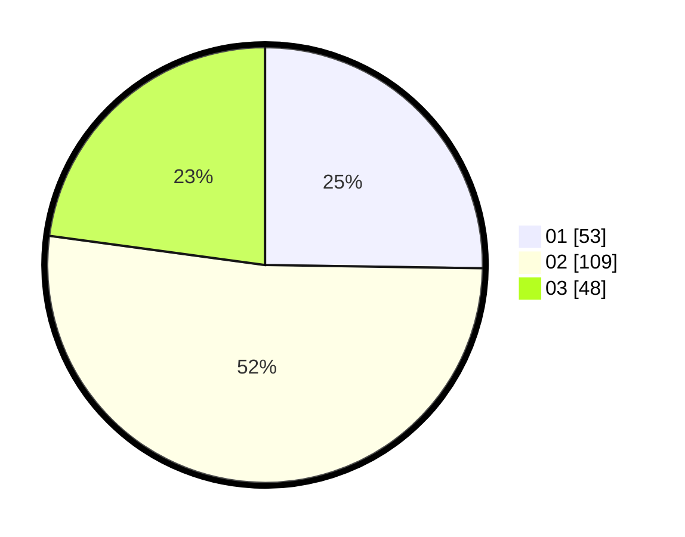

# Hasil

Hasil perolehan suara paslon dapat dilihat pada file paslon-01.txt, paslon-02.txt, dan paslon-03.txt.

Jika tidak ada, artinya data tersebut belum ada pada SIREKAP.

## Perolehan Suara

 * Paslon 01: **53**.
 * Paslon 02: **109**.
 * Paslon 03: **48**.

## Foto C Plano

https://sirekap-obj-formc.kpu.go.id/55d2/pemilu/ppwp/31/75/03/10/07/3175031007022-20240214-155630--8073364b-206e-47d8-9208-4996636e36f3.jpg

https://sirekap-obj-formc.kpu.go.id/55d2/pemilu/ppwp/31/75/03/10/07/3175031007022-20240214-155643--3555d2c0-4141-451d-a448-534d4a7921d0.jpg

https://sirekap-obj-formc.kpu.go.id/55d2/pemilu/ppwp/31/75/03/10/07/3175031007022-20240214-155655--125e9b2d-3dfe-4e73-b611-74fd90a7f58f.jpg

## DATA PEMILIH TETAP

Jumlah pemilih dalam DPT: **282**.
 * L: **141**.
 * P: **141**.

## DATA PENGGUNA HAK PILIH

Jumlah pengguna hak pilih dalam DPT: **214**.
 * L: **103**.
 * P: **111**.

Jumlah pengguna hak pilih dalam DPTb: **0**.
 * L: **0**.
 * P: **0**.

Jumlah pengguna hak pilih dalam DPK: **1**.
 * L: **0**.
 * P: **1**.

Jumlah pengguna hak pilih: **215**.
 * L: **103**.
 * P: **112**.

## JUMLAH SUARA SAH DAN TIDAK SAH

JUMLAH SELURUH SUARA SAH: **210**.

JUMLAH SUARA TIDAK SAH: **5**.

JUMLAH SELURUH SUARA SAH DAN SUARA TIDAK SAH: **215**.
