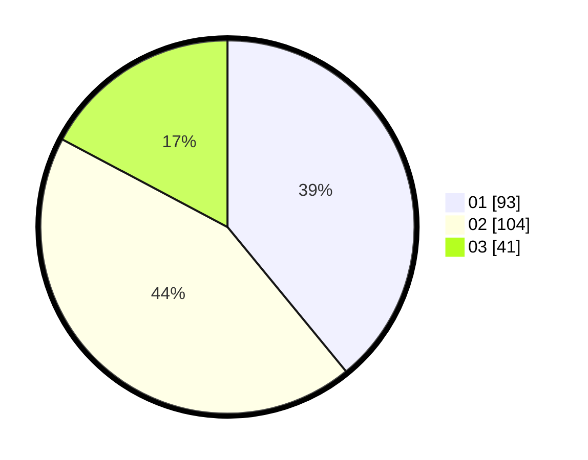

# Hasil

Hasil perolehan suara paslon dapat dilihat pada file paslon-01.txt, paslon-02.txt, dan paslon-03.txt.

Jika tidak ada, artinya data tersebut belum ada pada SIREKAP.

## Perolehan Suara

 * Paslon 01: **93**.
 * Paslon 02: **104**.
 * Paslon 03: **41**.

## Foto C Plano

https://sirekap-obj-formc.kpu.go.id/224d/pemilu/ppwp/31/75/03/10/07/3175031007028-20240214-203422--803e32fd-3416-46c8-801e-fae30455b217.jpg

https://sirekap-obj-formc.kpu.go.id/224d/pemilu/ppwp/31/75/03/10/07/3175031007028-20240214-203547--1f7f4588-075f-4fc6-95fb-dfe36ff8eb6c.jpg

https://sirekap-obj-formc.kpu.go.id/224d/pemilu/ppwp/31/75/03/10/07/3175031007028-20240214-203710--a7bfc6d9-726d-4149-afe5-bc996f9287cc.jpg

## DATA PEMILIH TETAP

Jumlah pemilih dalam DPT: **280**.
 * L: **143**.
 * P: **137**.

## DATA PENGGUNA HAK PILIH

Jumlah pengguna hak pilih dalam DPT: **233**.
 * L: **117**.
 * P: **116**.

Jumlah pengguna hak pilih dalam DPTb: **5**.
 * L: **4**.
 * P: **1**.

Jumlah pengguna hak pilih dalam DPK: **4**.
 * L: **3**.
 * P: **1**.

Jumlah pengguna hak pilih: **242**.
 * L: **124**.
 * P: **118**.

## JUMLAH SUARA SAH DAN TIDAK SAH

JUMLAH SELURUH SUARA SAH: **238**.

JUMLAH SUARA TIDAK SAH: **5**.

JUMLAH SELURUH SUARA SAH DAN SUARA TIDAK SAH: **243**.
