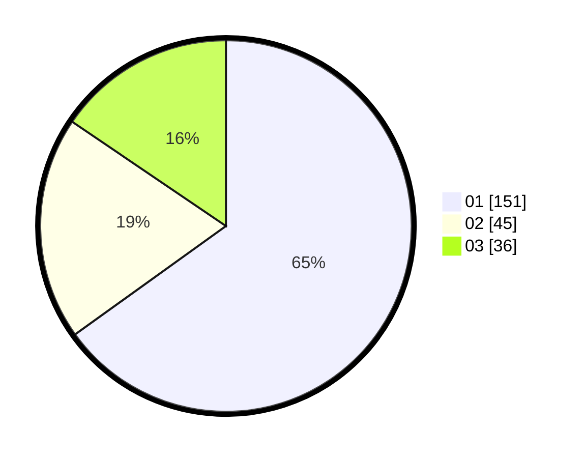

# Hasil

Hasil perolehan suara paslon dapat dilihat pada file paslon-01.txt, paslon-02.txt, dan paslon-03.txt.

Jika tidak ada, artinya data tersebut belum ada pada SIREKAP.

## Perolehan Suara

 * Paslon 01: **151**.
 * Paslon 02: **45**.
 * Paslon 03: **36**.

## Foto C Plano

https://sirekap-obj-formc.kpu.go.id/9bb1/pemilu/ppwp/31/75/03/10/07/3175031007030-20240216-034127--908f5b79-94c2-4d2d-9cb4-b8c681bc807d.jpg

https://sirekap-obj-formc.kpu.go.id/9bb1/pemilu/ppwp/31/75/03/10/07/3175031007030-20240216-034128--a30f24d0-9e9d-4d47-b897-9e7a198ae59f.jpg

https://sirekap-obj-formc.kpu.go.id/9bb1/pemilu/ppwp/31/75/03/10/07/3175031007030-20240216-034127--dd1f0892-e02e-4c43-8bc6-bdc15ad75bc2.jpg

## DATA PEMILIH TETAP

Jumlah pemilih dalam DPT: **281**.
 * L: **132**.
 * P: **149**.

## DATA PENGGUNA HAK PILIH

Jumlah pengguna hak pilih dalam DPT: **231**.
 * L: **103**.
 * P: **128**.

Jumlah pengguna hak pilih dalam DPTb: **0**.
 * L: **0**.
 * P: **0**.

Jumlah pengguna hak pilih dalam DPK: **2**.
 * L: **0**.
 * P: **2**.

Jumlah pengguna hak pilih: **233**.
 * L: **103**.
 * P: **130**.

## JUMLAH SUARA SAH DAN TIDAK SAH

JUMLAH SELURUH SUARA SAH: **232**.

JUMLAH SUARA TIDAK SAH: **1**.

JUMLAH SELURUH SUARA SAH DAN SUARA TIDAK SAH: **233**.
