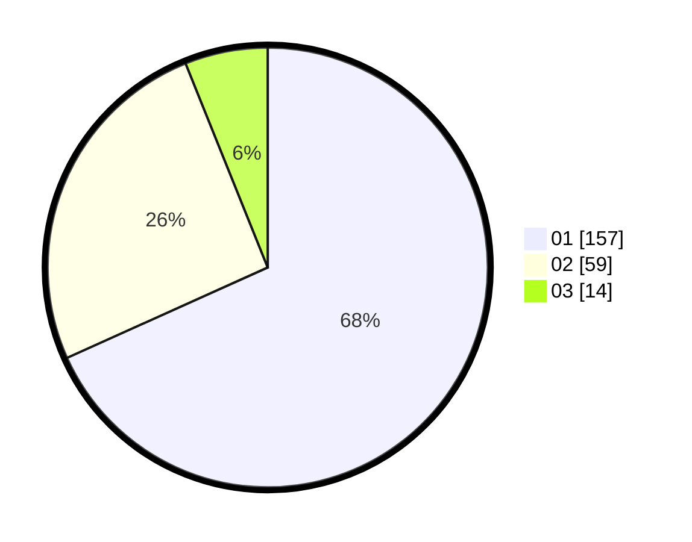

# Hasil

Hasil perolehan suara paslon dapat dilihat pada file paslon-01.txt, paslon-02.txt, dan paslon-03.txt.

Jika tidak ada, artinya data tersebut belum ada pada SIREKAP.

## Perolehan Suara

 * Paslon 01: **157**.
 * Paslon 02: **59**.
 * Paslon 03: **14**.

## Foto C Plano

https://sirekap-obj-formc.kpu.go.id/0395/pemilu/ppwp/31/75/03/10/07/3175031007031-20240215-025753--b9cdc435-07bd-49e6-abcf-70d7ea43ae1d.jpg

https://sirekap-obj-formc.kpu.go.id/0395/pemilu/ppwp/31/75/03/10/07/3175031007031-20240215-025822--1c58838c-c0d5-4111-8180-f07ff8d94567.jpg

https://sirekap-obj-formc.kpu.go.id/0395/pemilu/ppwp/31/75/03/10/07/3175031007031-20240215-160315--aff85f0e-22d6-4256-b440-2adb33593f3c.jpg

## DATA PEMILIH TETAP

Jumlah pemilih dalam DPT: **276**.
 * L: **131**.
 * P: **145**.

## DATA PENGGUNA HAK PILIH

Jumlah pengguna hak pilih dalam DPT: **232**.
 * L: **107**.
 * P: **125**.

Jumlah pengguna hak pilih dalam DPTb: **0**.
 * L: **0**.
 * P: **0**.

Jumlah pengguna hak pilih dalam DPK: **0**.
 * L: **0**.
 * P: **0**.

Jumlah pengguna hak pilih: **232**.
 * L: **107**.
 * P: **125**.

## JUMLAH SUARA SAH DAN TIDAK SAH

JUMLAH SELURUH SUARA SAH: **230**.

JUMLAH SUARA TIDAK SAH: **2**.

JUMLAH SELURUH SUARA SAH DAN SUARA TIDAK SAH: **232**.
