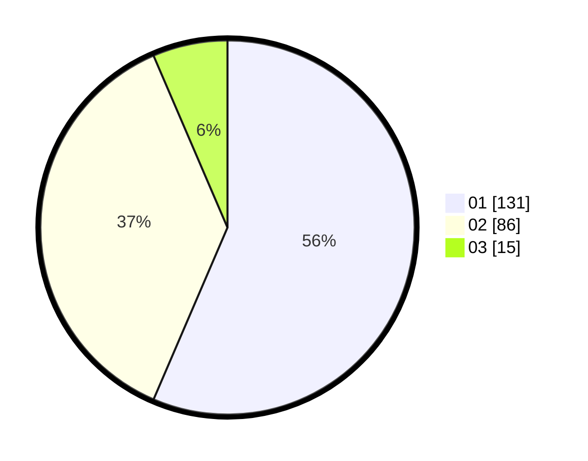

# Hasil

Hasil perolehan suara paslon dapat dilihat pada file paslon-01.txt, paslon-02.txt, dan paslon-03.txt.

Jika tidak ada, artinya data tersebut belum ada pada SIREKAP.

## Perolehan Suara

 * Paslon 01: **131**.
 * Paslon 02: **86**.
 * Paslon 03: **15**.

## Foto C Plano

https://sirekap-obj-formc.kpu.go.id/ebe9/pemilu/ppwp/31/75/03/10/07/3175031007034-20240214-205046--8c817ece-fa7c-44e6-95a0-038d4d7dff4f.jpg

https://sirekap-obj-formc.kpu.go.id/ebe9/pemilu/ppwp/31/75/03/10/07/3175031007034-20240214-205317--a54af34b-9589-48d4-9b52-81d7097026ac.jpg
