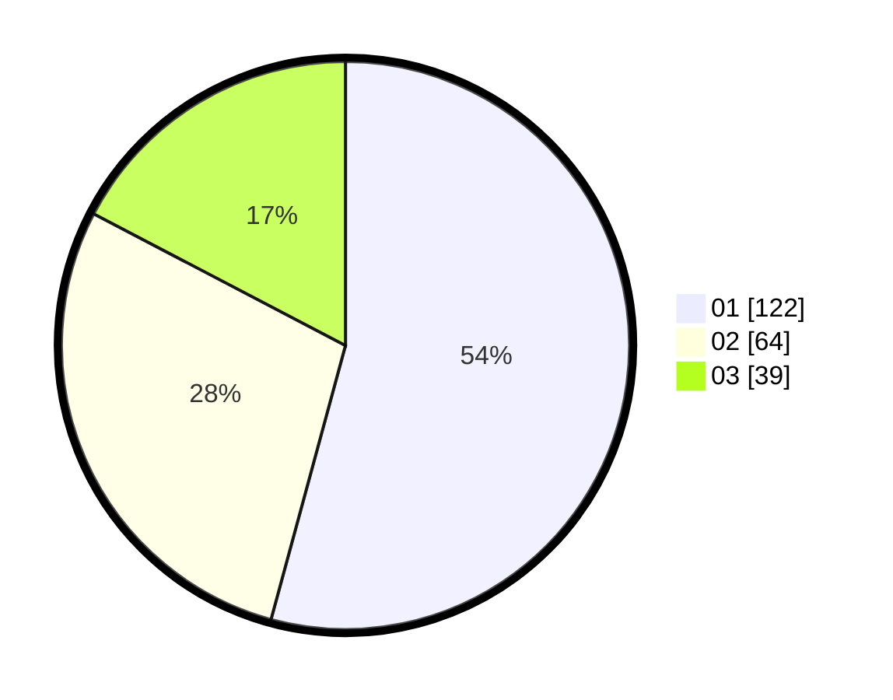

# Hasil

Hasil perolehan suara paslon dapat dilihat pada file paslon-01.txt, paslon-02.txt, dan paslon-03.txt.

Jika tidak ada, artinya data tersebut belum ada pada SIREKAP.

## Perolehan Suara

 * Paslon 01: **122**.
 * Paslon 02: **64**.
 * Paslon 03: **39**.

## Foto C Plano

https://sirekap-obj-formc.kpu.go.id/65ee/pemilu/ppwp/31/75/03/10/07/3175031007036-20240217-080819--5df50f6b-3213-423e-beb5-ab2fb06facc2.jpg

https://sirekap-obj-formc.kpu.go.id/65ee/pemilu/ppwp/31/75/03/10/07/3175031007036-20240217-080924--e130ed26-8e3f-43c5-a30e-693a02d97f0a.jpg

https://sirekap-obj-formc.kpu.go.id/65ee/pemilu/ppwp/31/75/03/10/07/3175031007036-20240217-081043--d8ef3d65-e153-49a2-bf04-9d7b311baaca.jpg

## DATA PEMILIH TETAP

Jumlah pemilih dalam DPT: **282**.
 * L: **140**.
 * P: **142**.

## DATA PENGGUNA HAK PILIH

Jumlah pengguna hak pilih dalam DPT: **234**.
 * L: **105**.
 * P: **129**.

Jumlah pengguna hak pilih dalam DPTb: **0**.
 * L: **0**.
 * P: **0**.

Jumlah pengguna hak pilih dalam DPK: **1**.
 * L: **1**.
 * P: **0**.

Jumlah pengguna hak pilih: **235**.
 * L: **106**.
 * P: **129**.

## JUMLAH SUARA SAH DAN TIDAK SAH

JUMLAH SELURUH SUARA SAH: **225**.

JUMLAH SUARA TIDAK SAH: **10**.

JUMLAH SELURUH SUARA SAH DAN SUARA TIDAK SAH: **235**.
