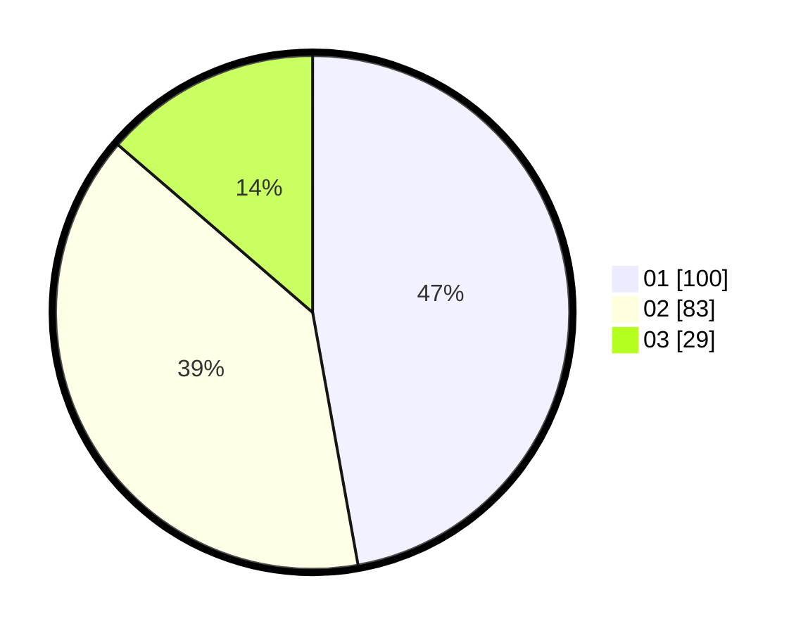

# Hasil

Hasil perolehan suara paslon dapat dilihat pada file paslon-01.txt, paslon-02.txt, dan paslon-03.txt.

Jika tidak ada, artinya data tersebut belum ada pada SIREKAP.

## Perolehan Suara

 * Paslon 01: **100**.
 * Paslon 02: **83**.
 * Paslon 03: **29**.

## Foto C Plano

https://sirekap-obj-formc.kpu.go.id/a2be/pemilu/ppwp/31/75/03/10/07/3175031007039-20240214-215035--ecf4952d-7574-4353-bf00-0228361fe945.jpg

https://sirekap-obj-formc.kpu.go.id/a2be/pemilu/ppwp/31/75/03/10/07/3175031007039-20240214-215120--f4581702-4487-4f0d-9c5a-2e0d34abf756.jpg

https://sirekap-obj-formc.kpu.go.id/a2be/pemilu/ppwp/31/75/03/10/07/3175031007039-20240214-215157--5b794c31-0d93-4e49-9fcf-dcdb20866ca7.jpg

## DATA PEMILIH TETAP

Jumlah pemilih dalam DPT: **269**.
 * L: **138**.
 * P: **131**.

## DATA PENGGUNA HAK PILIH

Jumlah pengguna hak pilih dalam DPT: **212**.
 * L: **102**.
 * P: **110**.

Jumlah pengguna hak pilih dalam DPTb: **0**.
 * L: **0**.
 * P: **0**.

Jumlah pengguna hak pilih dalam DPK: **1**.
 * L: **0**.
 * P: **1**.

Jumlah pengguna hak pilih: **213**.
 * L: **102**.
 * P: **111**.

## JUMLAH SUARA SAH DAN TIDAK SAH

JUMLAH SELURUH SUARA SAH: **212**.

JUMLAH SUARA TIDAK SAH: **1**.

JUMLAH SELURUH SUARA SAH DAN SUARA TIDAK SAH: **213**.
