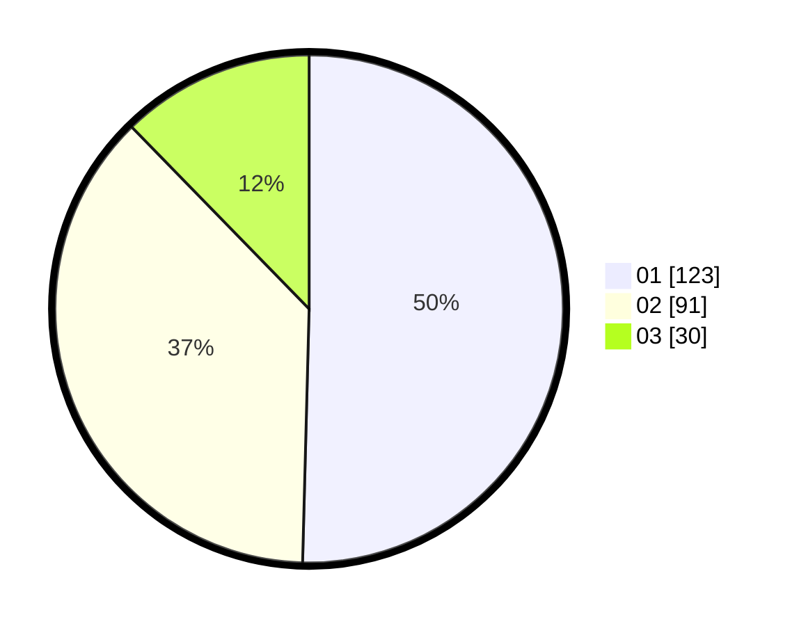

# Hasil

Hasil perolehan suara paslon dapat dilihat pada file paslon-01.txt, paslon-02.txt, dan paslon-03.txt.

Jika tidak ada, artinya data tersebut belum ada pada SIREKAP.

## Perolehan Suara

 * Paslon 01: **123**.
 * Paslon 02: **91**.
 * Paslon 03: **30**.

## Foto C Plano

https://sirekap-obj-formc.kpu.go.id/4e97/pemilu/ppwp/31/75/03/10/07/3175031007045-20240214-230412--e0110d0c-09bc-41a1-9b79-9afd2d7efea0.jpg

https://sirekap-obj-formc.kpu.go.id/4e97/pemilu/ppwp/31/75/03/10/07/3175031007045-20240214-230924--5f81ebb8-2614-4e68-ad8e-ef81e82bd287.jpg
