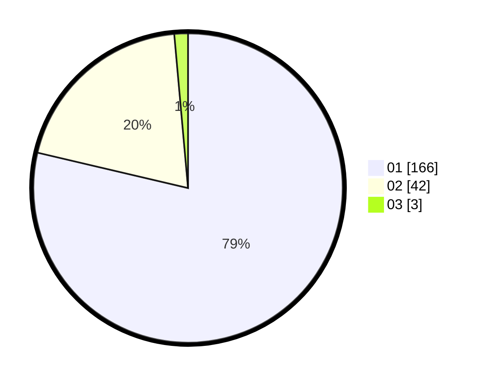

# Hasil

Hasil perolehan suara paslon dapat dilihat pada file paslon-01.txt, paslon-02.txt, dan paslon-03.txt.

Jika tidak ada, artinya data tersebut belum ada pada SIREKAP.

## Perolehan Suara

 * Paslon 01: **166**.
 * Paslon 02: **42**.
 * Paslon 03: **3**.

## Foto C Plano

https://sirekap-obj-formc.kpu.go.id/809d/pemilu/ppwp/31/75/03/10/07/3175031007046-20240216-020350--d70fe995-0597-4215-a15c-5c4272921840.jpg

https://sirekap-obj-formc.kpu.go.id/809d/pemilu/ppwp/31/75/03/10/07/3175031007046-20240216-020409--839eaf38-5270-43c3-95e6-ec37c41af642.jpg

https://sirekap-obj-formc.kpu.go.id/809d/pemilu/ppwp/31/75/03/10/07/3175031007046-20240216-020401--52533f68-01a0-4439-9d83-67d342bb19d6.jpg

## DATA PEMILIH TETAP

Jumlah pemilih dalam DPT: **265**.
 * L: **129**.
 * P: **136**.

## DATA PENGGUNA HAK PILIH

Jumlah pengguna hak pilih dalam DPT: **220**.
 * L: **102**.
 * P: **118**.

Jumlah pengguna hak pilih dalam DPTb: **0**.
 * L: **0**.
 * P: **0**.

Jumlah pengguna hak pilih dalam DPK: **0**.
 * L: **0**.
 * P: **0**.

Jumlah pengguna hak pilih: **220**.
 * L: **102**.
 * P: **118**.

## JUMLAH SUARA SAH DAN TIDAK SAH

JUMLAH SELURUH SUARA SAH: **211**.

JUMLAH SUARA TIDAK SAH: **9**.

JUMLAH SELURUH SUARA SAH DAN SUARA TIDAK SAH: **220**.
