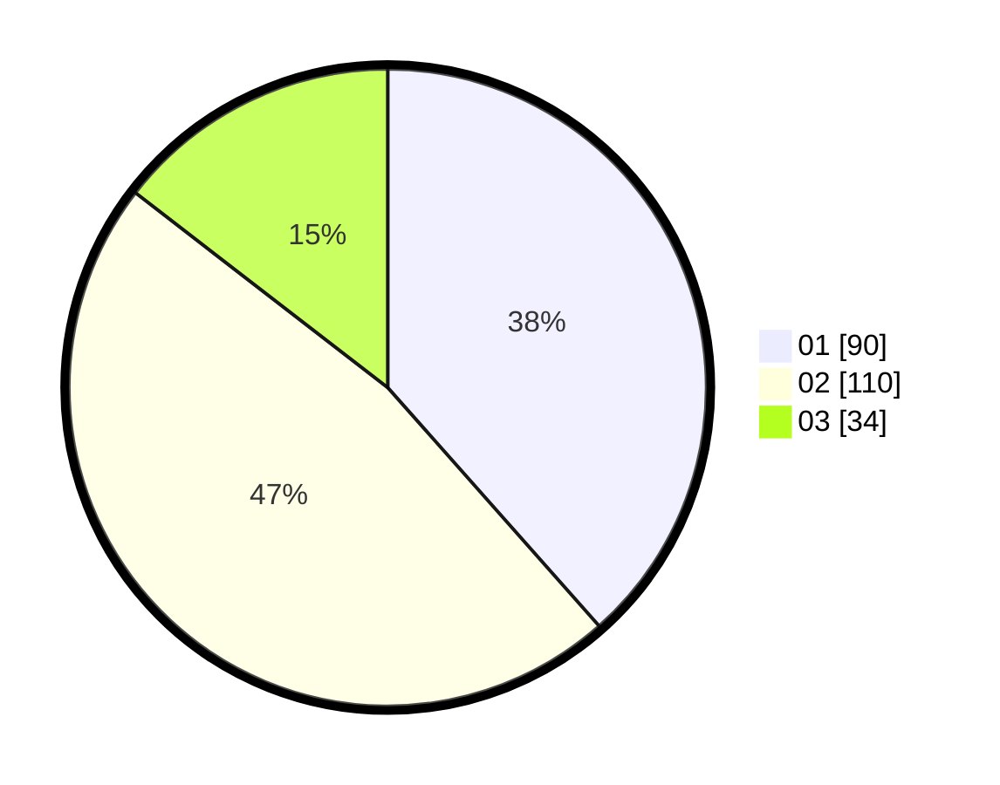

# Hasil

Hasil perolehan suara paslon dapat dilihat pada file paslon-01.txt, paslon-02.txt, dan paslon-03.txt.

Jika tidak ada, artinya data tersebut belum ada pada SIREKAP.

## Perolehan Suara

 * Paslon 01: **90**.
 * Paslon 02: **110**.
 * Paslon 03: **34**.

## Foto C Plano

https://sirekap-obj-formc.kpu.go.id/23f0/pemilu/ppwp/31/75/03/10/07/3175031007051-20240215-220442--ce47165b-3f91-4789-8511-002719bdee5d.jpg

https://sirekap-obj-formc.kpu.go.id/23f0/pemilu/ppwp/31/75/03/10/07/3175031007051-20240215-220445--a3c8416f-38fd-42da-8004-d199e4313fed.jpg

https://sirekap-obj-formc.kpu.go.id/23f0/pemilu/ppwp/31/75/03/10/07/3175031007051-20240215-220443--8105fc59-fe44-4324-ba78-25c5f9a37a9f.jpg

## DATA PEMILIH TETAP

Jumlah pemilih dalam DPT: **280**.
 * L: **138**.
 * P: **142**.

## DATA PENGGUNA HAK PILIH

Jumlah pengguna hak pilih dalam DPT: **228**.
 * L: **111**.
 * P: **117**.

Jumlah pengguna hak pilih dalam DPTb: **4**.
 * L: **2**.
 * P: **2**.

Jumlah pengguna hak pilih dalam DPK: **3**.
 * L: **2**.
 * P: **1**.

Jumlah pengguna hak pilih: **235**.
 * L: **115**.
 * P: **120**.

## JUMLAH SUARA SAH DAN TIDAK SAH

JUMLAH SELURUH SUARA SAH: **234**.

JUMLAH SUARA TIDAK SAH: **1**.

JUMLAH SELURUH SUARA SAH DAN SUARA TIDAK SAH: **235**.
