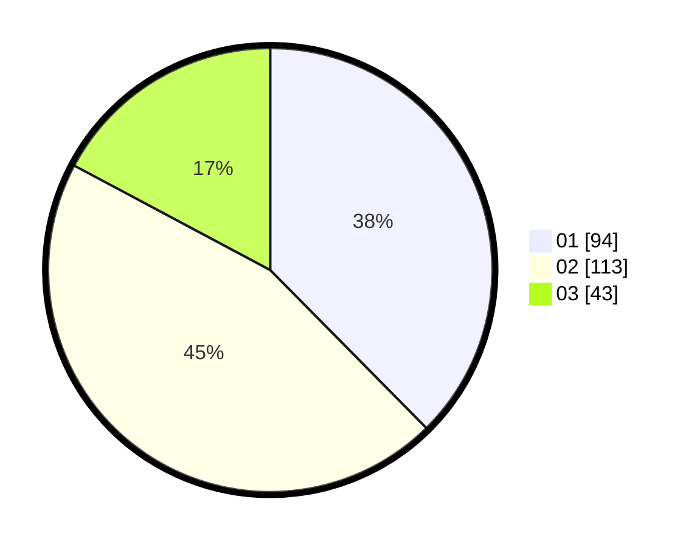

# Hasil

Hasil perolehan suara paslon dapat dilihat pada file paslon-01.txt, paslon-02.txt, dan paslon-03.txt.

Jika tidak ada, artinya data tersebut belum ada pada SIREKAP.

## Perolehan Suara

 * Paslon 01: **94**.
 * Paslon 02: **113**.
 * Paslon 03: **43**.

## Foto C Plano

https://sirekap-obj-formc.kpu.go.id/f997/pemilu/ppwp/31/75/03/10/07/3175031007055-20240214-160144--b788a70a-71aa-4aff-9f6f-f06c5007dd5a.jpg

https://sirekap-obj-formc.kpu.go.id/f997/pemilu/ppwp/31/75/03/10/07/3175031007055-20240214-203910--9d761853-762e-406e-a9e4-ea3f8f4fde7e.jpg

https://sirekap-obj-formc.kpu.go.id/f997/pemilu/ppwp/31/75/03/10/07/3175031007055-20240214-203918--f68c642c-5e39-4199-8c62-f2f8a336470a.jpg

## DATA PEMILIH TETAP

Jumlah pemilih dalam DPT: **293**.
 * L: **150**.
 * P: **143**.

## DATA PENGGUNA HAK PILIH

Jumlah pengguna hak pilih dalam DPT: **242**.
 * L: **118**.
 * P: **124**.

Jumlah pengguna hak pilih dalam DPTb: **6**.
 * L: **4**.
 * P: **2**.

Jumlah pengguna hak pilih dalam DPK: **3**.
 * L: **2**.
 * P: **1**.

Jumlah pengguna hak pilih: **251**.
 * L: **124**.
 * P: **127**.

## JUMLAH SUARA SAH DAN TIDAK SAH

JUMLAH SELURUH SUARA SAH: **250**.

JUMLAH SUARA TIDAK SAH: **1**.

JUMLAH SELURUH SUARA SAH DAN SUARA TIDAK SAH: **251**.
