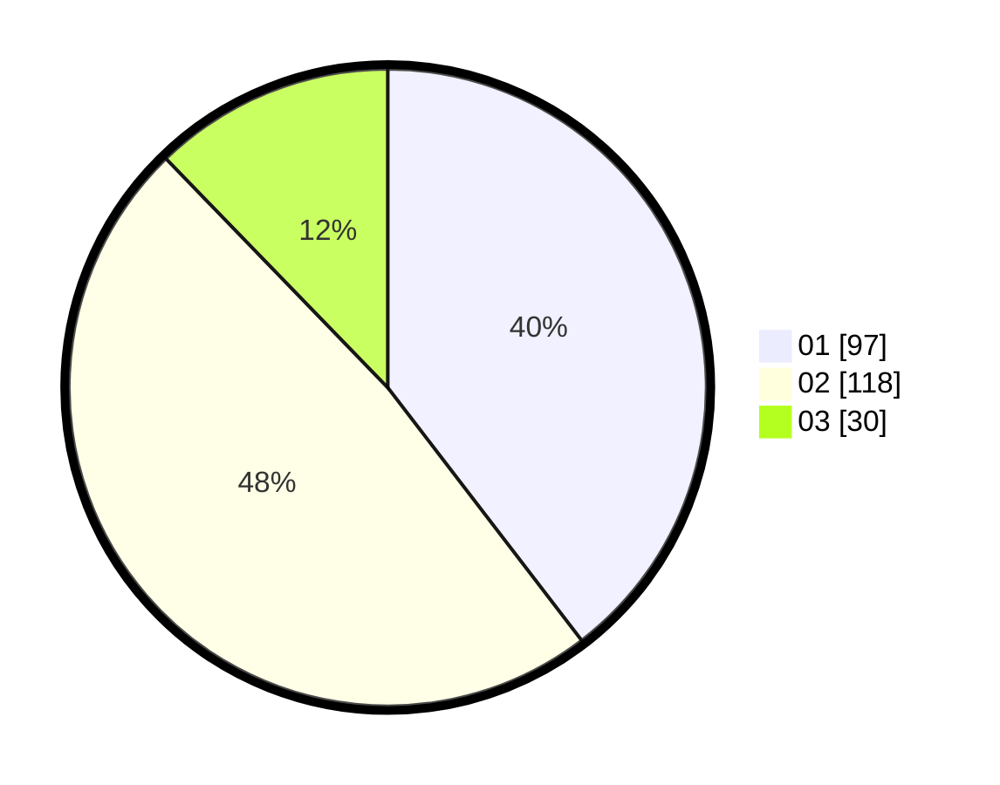

# Hasil

Hasil perolehan suara paslon dapat dilihat pada file paslon-01.txt, paslon-02.txt, dan paslon-03.txt.

Jika tidak ada, artinya data tersebut belum ada pada SIREKAP.

## Perolehan Suara

 * Paslon 01: **97**.
 * Paslon 02: **118**.
 * Paslon 03: **30**.

## Foto C Plano

https://sirekap-obj-formc.kpu.go.id/c04f/pemilu/ppwp/31/75/03/10/07/3175031007056-20240214-214402--024c6e79-71f5-4ea9-88c0-29b831087f10.jpg

https://sirekap-obj-formc.kpu.go.id/c04f/pemilu/ppwp/31/75/03/10/07/3175031007056-20240214-214523--c9ca1f1f-5d8f-4667-b29e-84f96016934a.jpg
