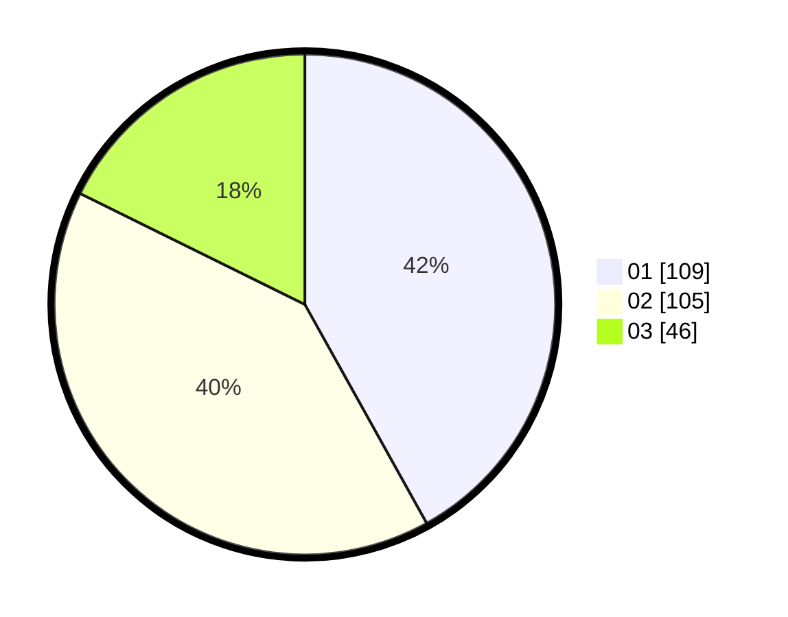

# Hasil

Hasil perolehan suara paslon dapat dilihat pada file paslon-01.txt, paslon-02.txt, dan paslon-03.txt.

Jika tidak ada, artinya data tersebut belum ada pada SIREKAP.

## Perolehan Suara

 * Paslon 01: **109**.
 * Paslon 02: **105**.
 * Paslon 03: **46**.

## Foto C Plano

https://sirekap-obj-formc.kpu.go.id/6987/pemilu/ppwp/31/75/03/10/07/3175031007059-20240215-011322--cf9dc79e-e40d-46b9-a382-92577742e330.jpg

https://sirekap-obj-formc.kpu.go.id/6987/pemilu/ppwp/31/75/03/10/07/3175031007059-20240215-205059--4d9b139e-ba2c-4c5d-95bc-9e7e039e01ef.jpg

https://sirekap-obj-formc.kpu.go.id/6987/pemilu/ppwp/31/75/03/10/07/3175031007059-20240215-011655--02b9b987-8402-422b-b627-1e3cb9509b80.jpg

## DATA PEMILIH TETAP

Jumlah pemilih dalam DPT: **297**.
 * L: **150**.
 * P: **147**.

## DATA PENGGUNA HAK PILIH

Jumlah pengguna hak pilih dalam DPT: **265**.
 * L: **134**.
 * P: **131**.

Jumlah pengguna hak pilih dalam DPTb: **0**.
 * L: **0**.
 * P: **0**.

Jumlah pengguna hak pilih dalam DPK: **0**.
 * L: **0**.
 * P: **0**.

Jumlah pengguna hak pilih: **265**.
 * L: **134**.
 * P: **131**.

## JUMLAH SUARA SAH DAN TIDAK SAH

JUMLAH SELURUH SUARA SAH: **260**.

JUMLAH SUARA TIDAK SAH: **5**.

JUMLAH SELURUH SUARA SAH DAN SUARA TIDAK SAH: **265**.
