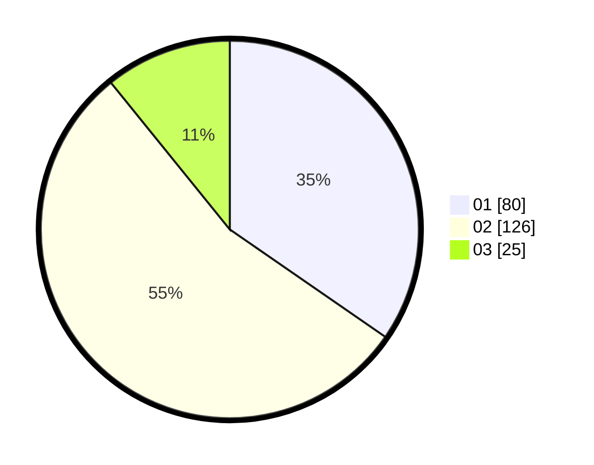

# Hasil

Hasil perolehan suara paslon dapat dilihat pada file paslon-01.txt, paslon-02.txt, dan paslon-03.txt.

Jika tidak ada, artinya data tersebut belum ada pada SIREKAP.

## Perolehan Suara

 * Paslon 01: **80**.
 * Paslon 02: **126**.
 * Paslon 03: **25**.

## Foto C Plano

https://sirekap-obj-formc.kpu.go.id/a1d1/pemilu/ppwp/31/75/03/10/07/3175031007062-20240216-181936--53ce7a1b-4e7b-487b-a209-c9bce92b45d4.jpg

https://sirekap-obj-formc.kpu.go.id/a1d1/pemilu/ppwp/31/75/03/10/07/3175031007062-20240216-181938--4b7a5d47-240f-4058-b710-32abb03e6f88.jpg

https://sirekap-obj-formc.kpu.go.id/a1d1/pemilu/ppwp/31/75/03/10/07/3175031007062-20240216-181937--8b0ddc98-be63-40cf-9848-c6b021f3df26.jpg

## DATA PEMILIH TETAP

Jumlah pemilih dalam DPT: **289**.
 * L: **159**.
 * P: **130**.

## DATA PENGGUNA HAK PILIH

Jumlah pengguna hak pilih dalam DPT: **226**.
 * L: **115**.
 * P: **111**.

Jumlah pengguna hak pilih dalam DPTb: **7**.
 * L: **3**.
 * P: **4**.

Jumlah pengguna hak pilih dalam DPK: **1**.
 * L: **1**.
 * P: **0**.

Jumlah pengguna hak pilih: **234**.
 * L: **119**.
 * P: **115**.

## JUMLAH SUARA SAH DAN TIDAK SAH

JUMLAH SELURUH SUARA SAH: **231**.

JUMLAH SUARA TIDAK SAH: **3**.

JUMLAH SELURUH SUARA SAH DAN SUARA TIDAK SAH: **234**.
