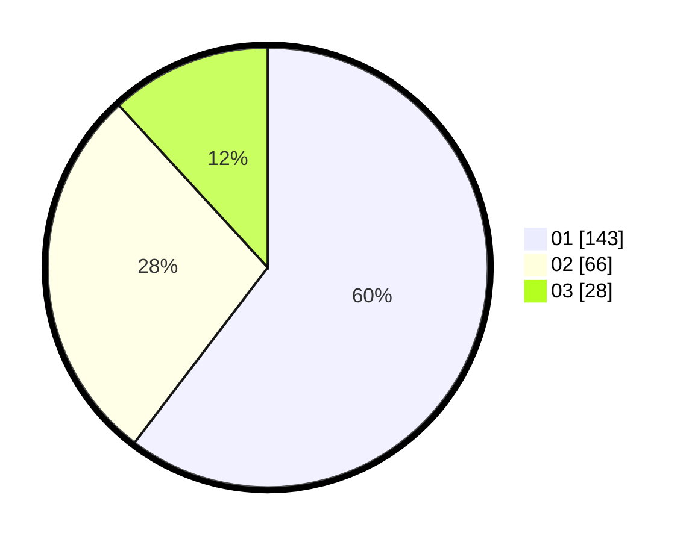

# Hasil

Hasil perolehan suara paslon dapat dilihat pada file paslon-01.txt, paslon-02.txt, dan paslon-03.txt.

Jika tidak ada, artinya data tersebut belum ada pada SIREKAP.

## Perolehan Suara

 * Paslon 01: **143**.
 * Paslon 02: **66**.
 * Paslon 03: **28**.

## Foto C Plano

https://sirekap-obj-formc.kpu.go.id/3fc6/pemilu/ppwp/31/75/03/10/07/3175031007069-20240214-194226--3cdc0c36-b06d-480b-ac02-49aac72e3956.jpg

https://sirekap-obj-formc.kpu.go.id/3fc6/pemilu/ppwp/31/75/03/10/07/3175031007069-20240214-193936--eaccfca6-e8b2-4778-873a-02a76ddba857.jpg

https://sirekap-obj-formc.kpu.go.id/3fc6/pemilu/ppwp/31/75/03/10/07/3175031007069-20240214-194307--82098049-d3b8-4a48-9b28-c73d2605424c.jpg

## DATA PEMILIH TETAP

Jumlah pemilih dalam DPT: **292**.
 * L: **142**.
 * P: **150**.

## DATA PENGGUNA HAK PILIH

Jumlah pengguna hak pilih dalam DPT: **238**.
 * L: **112**.
 * P: **126**.

Jumlah pengguna hak pilih dalam DPTb: **5**.
 * L: **2**.
 * P: **3**.

Jumlah pengguna hak pilih dalam DPK: **2**.
 * L: **2**.
 * P: **0**.

Jumlah pengguna hak pilih: **245**.
 * L: **116**.
 * P: **129**.

## JUMLAH SUARA SAH DAN TIDAK SAH

JUMLAH SELURUH SUARA SAH: **237**.

JUMLAH SUARA TIDAK SAH: **8**.

JUMLAH SELURUH SUARA SAH DAN SUARA TIDAK SAH: **245**.
