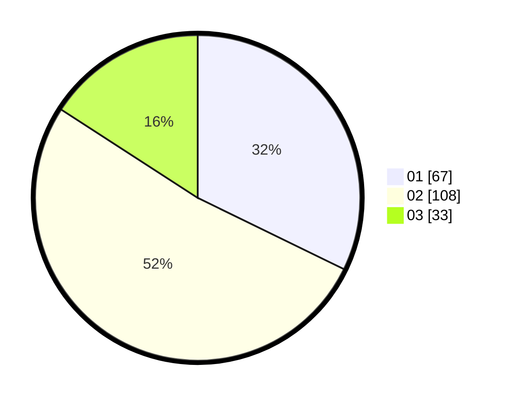

# Hasil

Hasil perolehan suara paslon dapat dilihat pada file paslon-01.txt, paslon-02.txt, dan paslon-03.txt.

Jika tidak ada, artinya data tersebut belum ada pada SIREKAP.

## Perolehan Suara

 * Paslon 01: **67**.
 * Paslon 02: **108**.
 * Paslon 03: **33**.

## Foto C Plano

https://sirekap-obj-formc.kpu.go.id/bba5/pemilu/ppwp/31/75/03/10/07/3175031007070-20240214-224741--c40635bd-db07-4b7c-8cfd-dcd29d04df96.jpg

https://sirekap-obj-formc.kpu.go.id/bba5/pemilu/ppwp/31/75/03/10/07/3175031007070-20240214-202231--18fb56d8-1555-4182-8f3f-cc744fef73ac.jpg

https://sirekap-obj-formc.kpu.go.id/bba5/pemilu/ppwp/31/75/03/10/07/3175031007070-20240214-202248--4205ca22-2840-4735-aaf0-a854a133a87a.jpg
