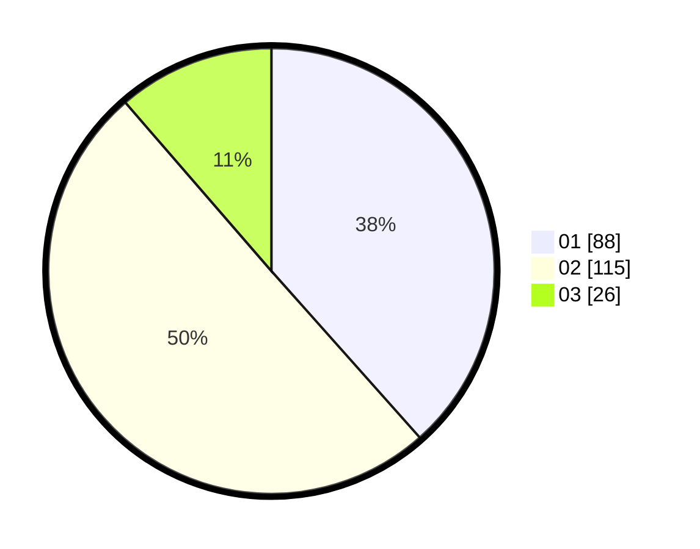

# Hasil

Hasil perolehan suara paslon dapat dilihat pada file paslon-01.txt, paslon-02.txt, dan paslon-03.txt.

Jika tidak ada, artinya data tersebut belum ada pada SIREKAP.

## Perolehan Suara

 * Paslon 01: **88**.
 * Paslon 02: **115**.
 * Paslon 03: **26**.

## Foto C Plano

https://sirekap-obj-formc.kpu.go.id/a3d7/pemilu/ppwp/31/75/03/10/07/3175031007073-20240215-211444--78efdfb9-9cb4-4686-a191-11e7176be846.jpg

https://sirekap-obj-formc.kpu.go.id/a3d7/pemilu/ppwp/31/75/03/10/07/3175031007073-20240215-211446--944ffe16-52da-4396-b4c8-11d090c8f20b.jpg

https://sirekap-obj-formc.kpu.go.id/a3d7/pemilu/ppwp/31/75/03/10/07/3175031007073-20240215-211445--947d6435-5cf4-4b28-9511-d9bf53dbd944.jpg

## DATA PEMILIH TETAP

Jumlah pemilih dalam DPT: **292**.
 * L: **133**.
 * P: **159**.

## DATA PENGGUNA HAK PILIH

Jumlah pengguna hak pilih dalam DPT: **231**.
 * L: **100**.
 * P: **131**.

Jumlah pengguna hak pilih dalam DPTb: **0**.
 * L: **0**.
 * P: **0**.

Jumlah pengguna hak pilih dalam DPK: **1**.
 * L: **1**.
 * P: **0**.

Jumlah pengguna hak pilih: **232**.
 * L: **101**.
 * P: **131**.

## JUMLAH SUARA SAH DAN TIDAK SAH

JUMLAH SELURUH SUARA SAH: **229**.

JUMLAH SUARA TIDAK SAH: **3**.

JUMLAH SELURUH SUARA SAH DAN SUARA TIDAK SAH: **232**.
