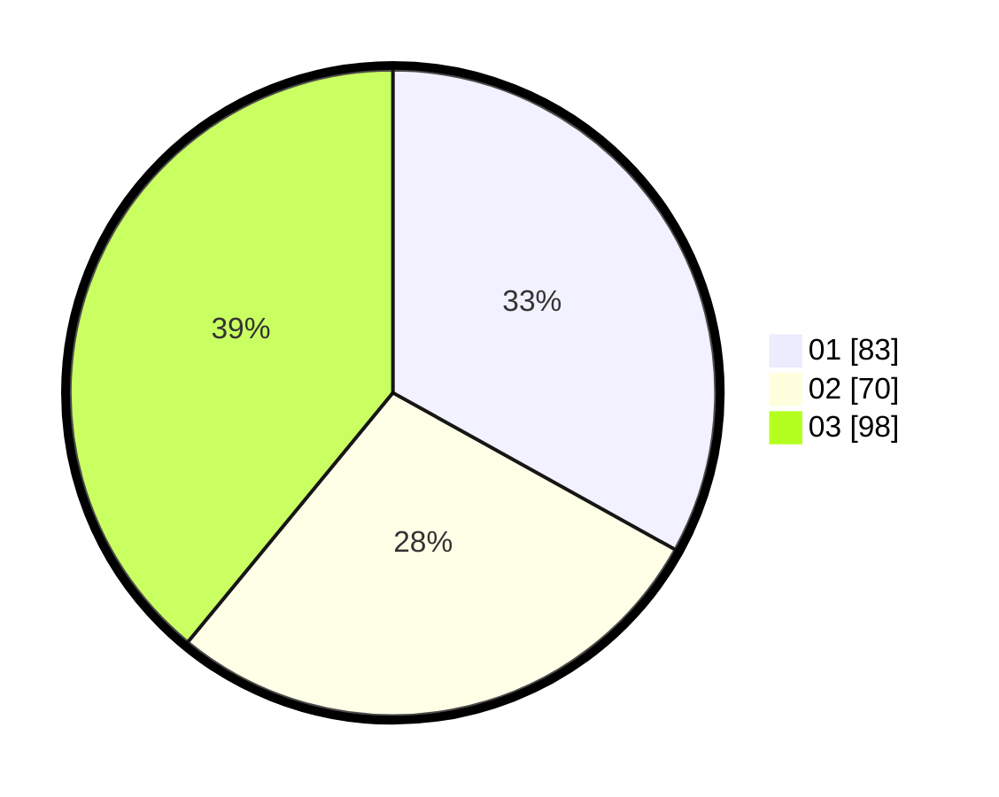

# Hasil

Hasil perolehan suara paslon dapat dilihat pada file paslon-01.txt, paslon-02.txt, dan paslon-03.txt.

Jika tidak ada, artinya data tersebut belum ada pada SIREKAP.

## Perolehan Suara

 * Paslon 01: **83**.
 * Paslon 02: **70**.
 * Paslon 03: **98**.

## Foto C Plano

https://sirekap-obj-formc.kpu.go.id/ef39/pemilu/ppwp/31/75/03/10/07/3175031007076-20240214-190637--9068a7e6-af3a-410a-bb14-df7b64e615aa.jpg

https://sirekap-obj-formc.kpu.go.id/ef39/pemilu/ppwp/31/75/03/10/07/3175031007076-20240214-193043--ccd78354-942c-46f0-963a-9c4cecd79113.jpg

https://sirekap-obj-formc.kpu.go.id/ef39/pemilu/ppwp/31/75/03/10/07/3175031007076-20240214-192843--0e083657-34b3-4204-a067-818382ded66a.jpg

## DATA PEMILIH TETAP

Jumlah pemilih dalam DPT: **287**.
 * L: **130**.
 * P: **157**.

## DATA PENGGUNA HAK PILIH

Jumlah pengguna hak pilih dalam DPT: **243**.
 * L: **104**.
 * P: **139**.

Jumlah pengguna hak pilih dalam DPTb: **9**.
 * L: **4**.
 * P: **5**.

Jumlah pengguna hak pilih dalam DPK: **3**.
 * L: **3**.
 * P: **0**.

Jumlah pengguna hak pilih: **255**.
 * L: **111**.
 * P: **144**.

## JUMLAH SUARA SAH DAN TIDAK SAH

JUMLAH SELURUH SUARA SAH: **251**.

JUMLAH SUARA TIDAK SAH: **4**.

JUMLAH SELURUH SUARA SAH DAN SUARA TIDAK SAH: **255**.
