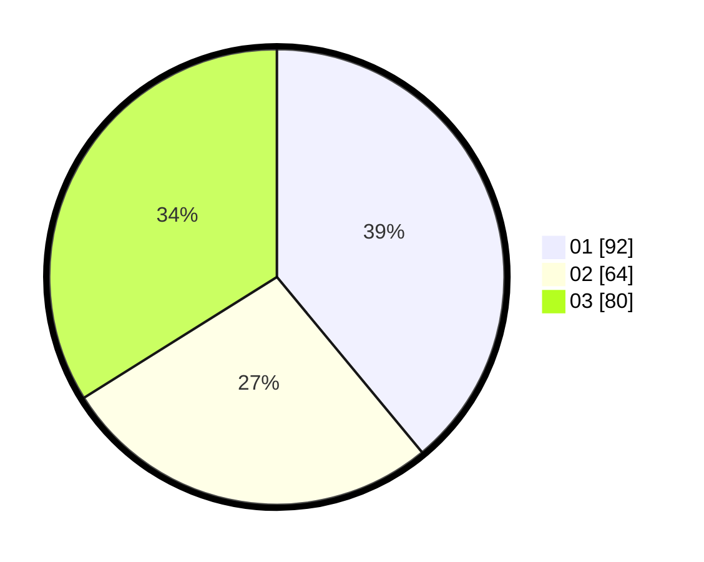

# Hasil

Hasil perolehan suara paslon dapat dilihat pada file paslon-01.txt, paslon-02.txt, dan paslon-03.txt.

Jika tidak ada, artinya data tersebut belum ada pada SIREKAP.

## Perolehan Suara

 * Paslon 01: **92**.
 * Paslon 02: **64**.
 * Paslon 03: **80**.

## Foto C Plano

https://sirekap-obj-formc.kpu.go.id/dc82/pemilu/ppwp/31/75/03/10/07/3175031007077-20240214-224534--72a28484-a226-486d-afeb-209edb5fe112.jpg

https://sirekap-obj-formc.kpu.go.id/dc82/pemilu/ppwp/31/75/03/10/07/3175031007077-20240214-224556--dd0ff928-f39e-435b-aedf-e4a3e90df263.jpg

https://sirekap-obj-formc.kpu.go.id/dc82/pemilu/ppwp/31/75/03/10/07/3175031007077-20240214-224606--a29f7b45-3266-47e0-aa6e-14628fc1fd0d.jpg

## DATA PEMILIH TETAP

Jumlah pemilih dalam DPT: **296**.
 * L: **141**.
 * P: **155**.

## DATA PENGGUNA HAK PILIH

Jumlah pengguna hak pilih dalam DPT: **226**.
 * L: **109**.
 * P: **117**.

Jumlah pengguna hak pilih dalam DPTb: **6**.
 * L: **3**.
 * P: **3**.

Jumlah pengguna hak pilih dalam DPK: **6**.
 * L: **5**.
 * P: **1**.

Jumlah pengguna hak pilih: **238**.
 * L: **117**.
 * P: **121**.

## JUMLAH SUARA SAH DAN TIDAK SAH

JUMLAH SELURUH SUARA SAH: **236**.

JUMLAH SUARA TIDAK SAH: **2**.

JUMLAH SELURUH SUARA SAH DAN SUARA TIDAK SAH: **238**.
