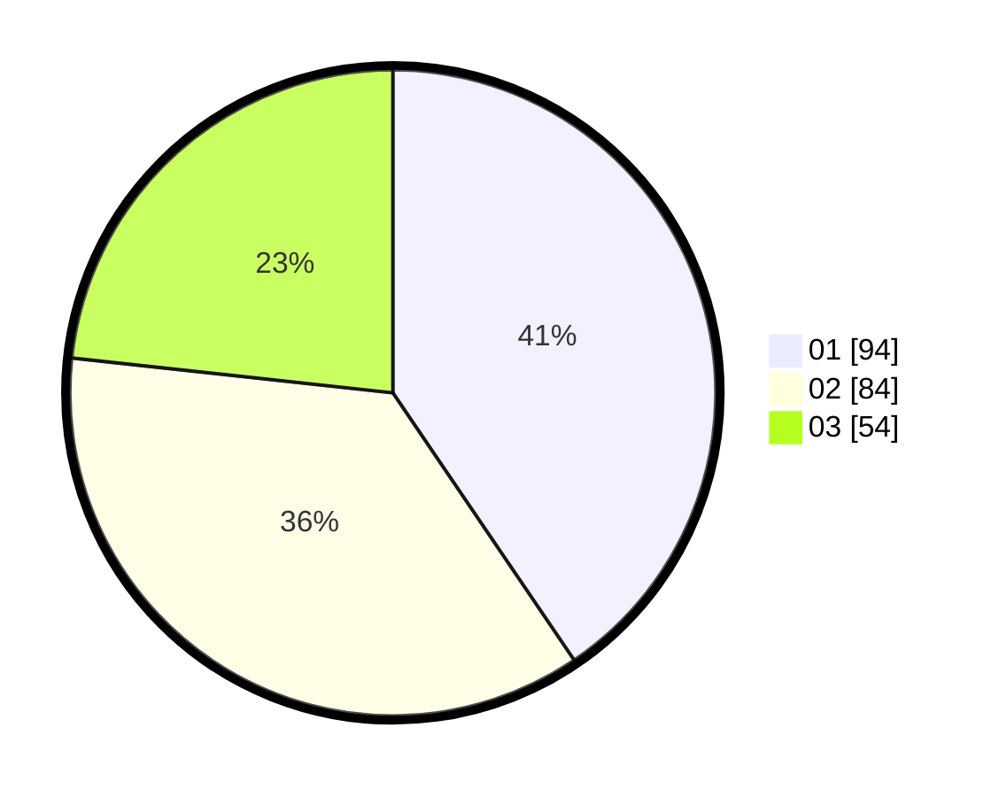

# Hasil

Hasil perolehan suara paslon dapat dilihat pada file paslon-01.txt, paslon-02.txt, dan paslon-03.txt.

Jika tidak ada, artinya data tersebut belum ada pada SIREKAP.

## Perolehan Suara

 * Paslon 01: **94**.
 * Paslon 02: **84**.
 * Paslon 03: **54**.

## Foto C Plano

https://sirekap-obj-formc.kpu.go.id/7829/pemilu/ppwp/31/75/03/10/07/3175031007080-20240214-210551--38d101c7-7718-4dcb-9d5e-97cc8af23fc8.jpg

https://sirekap-obj-formc.kpu.go.id/7829/pemilu/ppwp/31/75/03/10/07/3175031007080-20240214-210924--9fd2b0a4-6c05-413d-8536-29c7bacf94af.jpg

https://sirekap-obj-formc.kpu.go.id/7829/pemilu/ppwp/31/75/03/10/07/3175031007080-20240214-210836--abf48c27-8a1e-4bd2-9812-6f022e448ed3.jpg

## DATA PEMILIH TETAP

Jumlah pemilih dalam DPT: **293**.
 * L: **135**.
 * P: **158**.

## DATA PENGGUNA HAK PILIH

Jumlah pengguna hak pilih dalam DPT: **219**.
 * L: **99**.
 * P: **120**.

Jumlah pengguna hak pilih dalam DPTb: **14**.
 * L: **7**.
 * P: **7**.

Jumlah pengguna hak pilih dalam DPK: **1**.
 * L: **0**.
 * P: **1**.

Jumlah pengguna hak pilih: **234**.
 * L: **106**.
 * P: **128**.

## JUMLAH SUARA SAH DAN TIDAK SAH

JUMLAH SELURUH SUARA SAH: **232**.

JUMLAH SUARA TIDAK SAH: **2**.

JUMLAH SELURUH SUARA SAH DAN SUARA TIDAK SAH: **234**.
