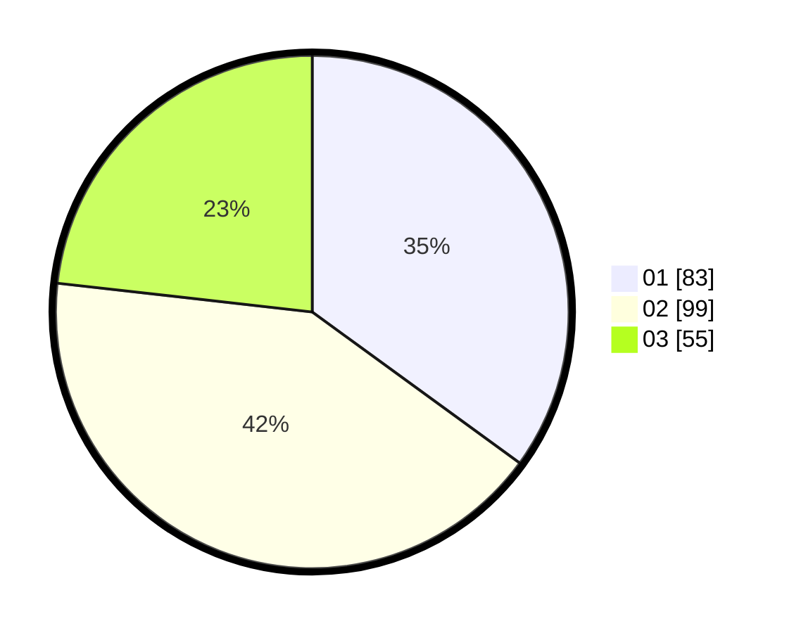

# Hasil

Hasil perolehan suara paslon dapat dilihat pada file paslon-01.txt, paslon-02.txt, dan paslon-03.txt.

Jika tidak ada, artinya data tersebut belum ada pada SIREKAP.

## Perolehan Suara

 * Paslon 01: **83**.
 * Paslon 02: **99**.
 * Paslon 03: **55**.

## Foto C Plano

https://sirekap-obj-formc.kpu.go.id/4030/pemilu/ppwp/31/75/03/10/07/3175031007082-20240214-211206--5f0e1aa2-365d-48af-b571-e6f7bf68e9ed.jpg

https://sirekap-obj-formc.kpu.go.id/4030/pemilu/ppwp/31/75/03/10/07/3175031007082-20240214-211302--16329cdc-0924-4503-a2e8-74d601fe0de0.jpg

https://sirekap-obj-formc.kpu.go.id/4030/pemilu/ppwp/31/75/03/10/07/3175031007082-20240214-211342--fe33787a-1cd6-4e18-b8fa-b2553f8472bd.jpg

## DATA PEMILIH TETAP

Jumlah pemilih dalam DPT: **218**.
 * L: **99**.
 * P: **119**.

## DATA PENGGUNA HAK PILIH

Jumlah pengguna hak pilih dalam DPT: **218**.
 * L: **99**.
 * P: **119**.

Jumlah pengguna hak pilih dalam DPTb: **19**.
 * L: **7**.
 * P: **12**.

Jumlah pengguna hak pilih dalam DPK: **4**.
 * L: **2**.
 * P: **2**.

Jumlah pengguna hak pilih: **241**.
 * L: **108**.
 * P: **133**.

## JUMLAH SUARA SAH DAN TIDAK SAH

JUMLAH SELURUH SUARA SAH: **237**.

JUMLAH SUARA TIDAK SAH: **4**.

JUMLAH SELURUH SUARA SAH DAN SUARA TIDAK SAH: **241**.
