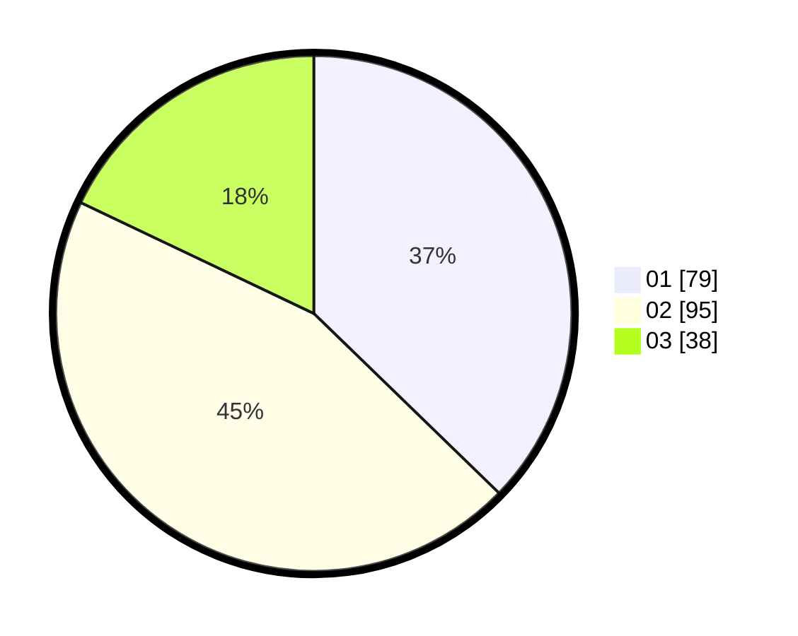

# Hasil

Hasil perolehan suara paslon dapat dilihat pada file paslon-01.txt, paslon-02.txt, dan paslon-03.txt.

Jika tidak ada, artinya data tersebut belum ada pada SIREKAP.

## Perolehan Suara

 * Paslon 01: **79**.
 * Paslon 02: **95**.
 * Paslon 03: **38**.

## Foto C Plano

https://sirekap-obj-formc.kpu.go.id/f236/pemilu/ppwp/31/75/03/10/07/3175031007086-20240214-190205--0b7ef407-776d-4c2b-98f0-3b0080d9c7bd.jpg

https://sirekap-obj-formc.kpu.go.id/f236/pemilu/ppwp/31/75/03/10/07/3175031007086-20240214-185831--25860ed6-fa63-4cf4-b9d5-d9284c01cdad.jpg

https://sirekap-obj-formc.kpu.go.id/f236/pemilu/ppwp/31/75/03/10/07/3175031007086-20240214-190038--d87d7174-901b-4360-8337-4fb4e1988892.jpg

## DATA PEMILIH TETAP

Jumlah pemilih dalam DPT: **184**.
 * L: **85**.
 * P: **99**.

## DATA PENGGUNA HAK PILIH

Jumlah pengguna hak pilih dalam DPT: **184**.
 * L: **85**.
 * P: **99**.

Jumlah pengguna hak pilih dalam DPTb: **28**.
 * L: **12**.
 * P: **16**.

Jumlah pengguna hak pilih dalam DPK: **2**.
 * L: **1**.
 * P: **1**.

Jumlah pengguna hak pilih: **214**.
 * L: **98**.
 * P: **106**.

## JUMLAH SUARA SAH DAN TIDAK SAH

JUMLAH SELURUH SUARA SAH: **212**.

JUMLAH SUARA TIDAK SAH: **2**.

JUMLAH SELURUH SUARA SAH DAN SUARA TIDAK SAH: **214**.
