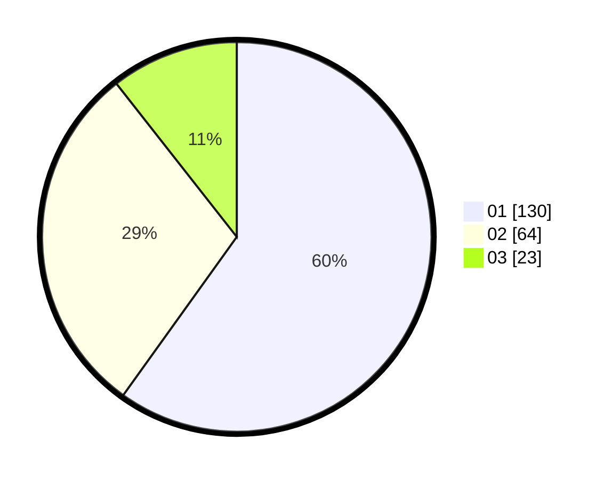

# Hasil

Hasil perolehan suara paslon dapat dilihat pada file paslon-01.txt, paslon-02.txt, dan paslon-03.txt.

Jika tidak ada, artinya data tersebut belum ada pada SIREKAP.

## Perolehan Suara

 * Paslon 01: **130**.
 * Paslon 02: **64**.
 * Paslon 03: **23**.

## Foto C Plano

https://sirekap-obj-formc.kpu.go.id/22ad/pemilu/ppwp/31/75/03/10/07/3175031007089-20240214-190010--a3d84972-9d8f-4137-b2ff-e6b9e0beb417.jpg

https://sirekap-obj-formc.kpu.go.id/22ad/pemilu/ppwp/31/75/03/10/07/3175031007089-20240214-232136--61d03a6c-a185-480d-99c5-b8d67847d5b6.jpg

https://sirekap-obj-formc.kpu.go.id/22ad/pemilu/ppwp/31/75/03/10/07/3175031007089-20240214-232203--4f1a782a-e193-4182-85cc-b57ea40a720d.jpg

## DATA PEMILIH TETAP

Jumlah pemilih dalam DPT: **292**.
 * L: **135**.
 * P: **157**.

## DATA PENGGUNA HAK PILIH

Jumlah pengguna hak pilih dalam DPT: **216**.
 * L: **98**.
 * P: **118**.

Jumlah pengguna hak pilih dalam DPTb: **6**.
 * L: **2**.
 * P: **4**.

Jumlah pengguna hak pilih dalam DPK: **0**.
 * L: **0**.
 * P: **0**.

Jumlah pengguna hak pilih: **222**.
 * L: **100**.
 * P: **122**.

## JUMLAH SUARA SAH DAN TIDAK SAH

JUMLAH SELURUH SUARA SAH: **217**.

JUMLAH SUARA TIDAK SAH: **5**.

JUMLAH SELURUH SUARA SAH DAN SUARA TIDAK SAH: **222**.
