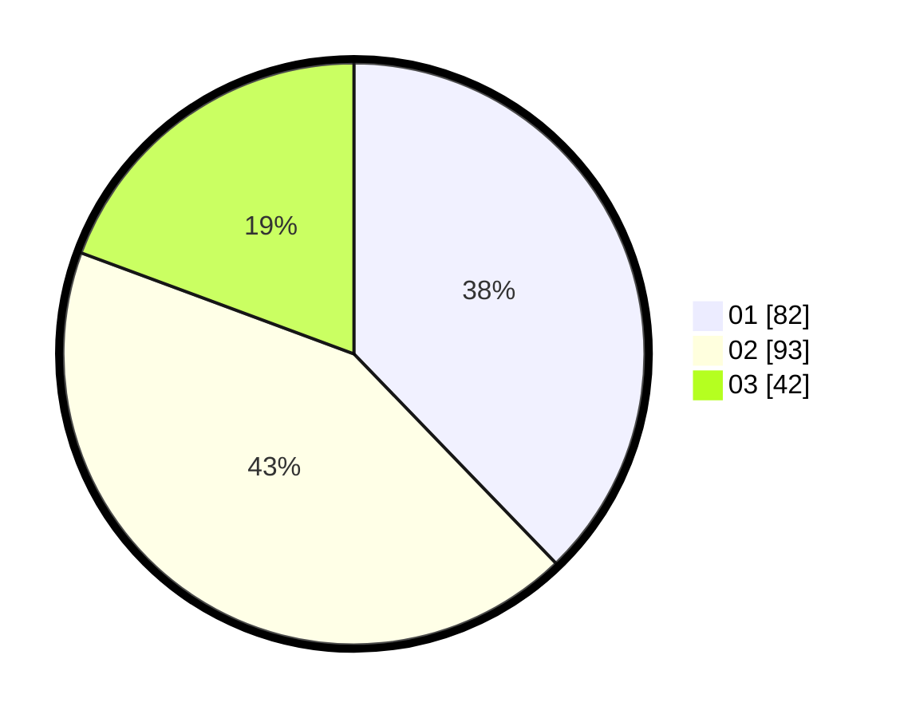

# Hasil

Hasil perolehan suara paslon dapat dilihat pada file paslon-01.txt, paslon-02.txt, dan paslon-03.txt.

Jika tidak ada, artinya data tersebut belum ada pada SIREKAP.

## Perolehan Suara

 * Paslon 01: **82**.
 * Paslon 02: **93**.
 * Paslon 03: **42**.

## Foto C Plano

https://sirekap-obj-formc.kpu.go.id/efe6/pemilu/ppwp/31/75/03/10/07/3175031007096-20240214-205156--b53be661-d2c2-4e30-b4a7-c1518ef8bc50.jpg

https://sirekap-obj-formc.kpu.go.id/efe6/pemilu/ppwp/31/75/03/10/07/3175031007096-20240214-215443--8a3ec443-a440-43f8-aa3f-475edfa50aac.jpg

https://sirekap-obj-formc.kpu.go.id/efe6/pemilu/ppwp/31/75/03/10/07/3175031007096-20240214-215141--153868dd-0941-4e9a-9d12-5920ece63c4f.jpg
