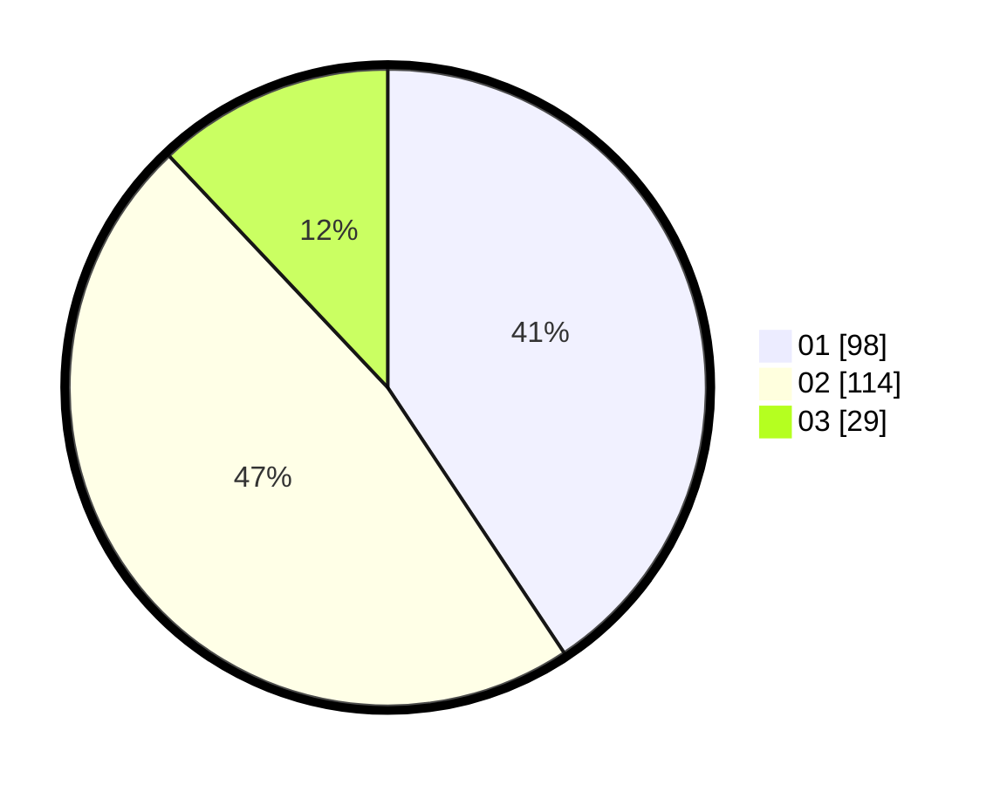

# Hasil

Hasil perolehan suara paslon dapat dilihat pada file paslon-01.txt, paslon-02.txt, dan paslon-03.txt.

Jika tidak ada, artinya data tersebut belum ada pada SIREKAP.

## Perolehan Suara

 * Paslon 01: **98**.
 * Paslon 02: **114**.
 * Paslon 03: **29**.

## Foto C Plano

https://sirekap-obj-formc.kpu.go.id/16f3/pemilu/ppwp/31/75/03/10/07/3175031007099-20240214-200923--f63ac7ef-f18f-4c53-b33c-89d836a39334.jpg

https://sirekap-obj-formc.kpu.go.id/16f3/pemilu/ppwp/31/75/03/10/07/3175031007099-20240214-225024--92559391-bd08-41fa-91bd-047f6a2eef36.jpg

https://sirekap-obj-formc.kpu.go.id/16f3/pemilu/ppwp/31/75/03/10/07/3175031007099-20240214-225145--2437a549-7b8e-49f4-b3a8-e806b5ae5d94.jpg

## DATA PEMILIH TETAP

Jumlah pemilih dalam DPT: **285**.
 * L: **138**.
 * P: **147**.

## DATA PENGGUNA HAK PILIH

Jumlah pengguna hak pilih dalam DPT: **236**.
 * L: **115**.
 * P: **121**.

Jumlah pengguna hak pilih dalam DPTb: **2**.
 * L: **0**.
 * P: **2**.

Jumlah pengguna hak pilih dalam DPK: **2**.
 * L: **0**.
 * P: **2**.

Jumlah pengguna hak pilih: **242**.
 * L: **118**.
 * P: **124**.

## JUMLAH SUARA SAH DAN TIDAK SAH

JUMLAH SELURUH SUARA SAH: **238**.

JUMLAH SUARA TIDAK SAH: **4**.

JUMLAH SELURUH SUARA SAH DAN SUARA TIDAK SAH: **242**.
