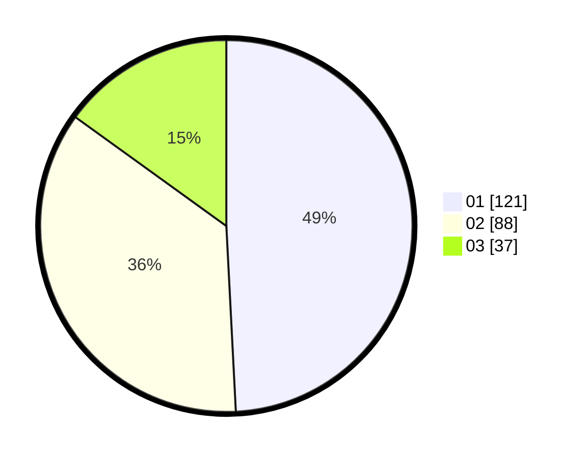

# Hasil

Hasil perolehan suara paslon dapat dilihat pada file paslon-01.txt, paslon-02.txt, dan paslon-03.txt.

Jika tidak ada, artinya data tersebut belum ada pada SIREKAP.

## Perolehan Suara

 * Paslon 01: **121**.
 * Paslon 02: **88**.
 * Paslon 03: **37**.

## Foto C Plano

https://sirekap-obj-formc.kpu.go.id/7f66/pemilu/ppwp/31/75/03/10/07/3175031007100-20240217-164239--fa8e2058-91b7-4002-96bc-0fa7087e7f15.jpg

https://sirekap-obj-formc.kpu.go.id/7f66/pemilu/ppwp/31/75/03/10/07/3175031007100-20240217-164330--d671afc2-ae95-4fe8-83d1-e8c644f082bf.jpg

https://sirekap-obj-formc.kpu.go.id/7f66/pemilu/ppwp/31/75/03/10/07/3175031007100-20240217-164457--9f95dad5-913c-43ac-912b-1cde7f16c7a8.jpg

## DATA PEMILIH TETAP

Jumlah pemilih dalam DPT: **285**.
 * L: **148**.
 * P: **137**.

## DATA PENGGUNA HAK PILIH

Jumlah pengguna hak pilih dalam DPT: **247**.
 * L: **129**.
 * P: **118**.

Jumlah pengguna hak pilih dalam DPTb: **1**.
 * L: **0**.
 * P: **1**.

Jumlah pengguna hak pilih dalam DPK: **0**.
 * L: **0**.
 * P: **0**.

Jumlah pengguna hak pilih: **248**.
 * L: **129**.
 * P: **119**.

## JUMLAH SUARA SAH DAN TIDAK SAH

JUMLAH SELURUH SUARA SAH: **246**.

JUMLAH SUARA TIDAK SAH: **2**.

JUMLAH SELURUH SUARA SAH DAN SUARA TIDAK SAH: **248**.
