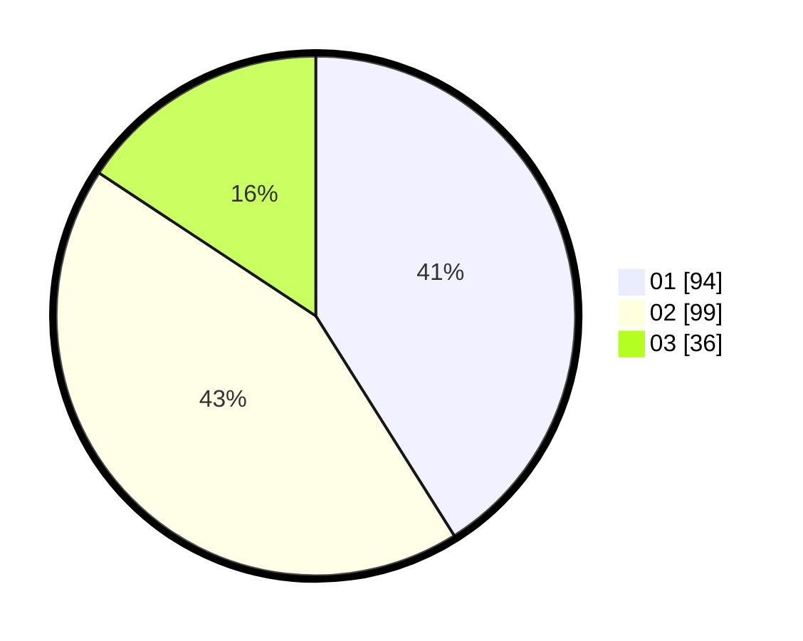

# Hasil

Hasil perolehan suara paslon dapat dilihat pada file paslon-01.txt, paslon-02.txt, dan paslon-03.txt.

Jika tidak ada, artinya data tersebut belum ada pada SIREKAP.

## Perolehan Suara

 * Paslon 01: **94**.
 * Paslon 02: **99**.
 * Paslon 03: **36**.

## Foto C Plano

https://sirekap-obj-formc.kpu.go.id/e703/pemilu/ppwp/31/75/03/10/07/3175031007103-20240214-205306--7c53ede3-1304-418e-91cf-742ed3790772.jpg

https://sirekap-obj-formc.kpu.go.id/e703/pemilu/ppwp/31/75/03/10/07/3175031007103-20240214-205617--9417b82f-01da-42a3-84ca-2910ec2f1aed.jpg

https://sirekap-obj-formc.kpu.go.id/e703/pemilu/ppwp/31/75/03/10/07/3175031007103-20240214-194132--54d86ba5-a657-435b-beac-a32b271a4188.jpg
