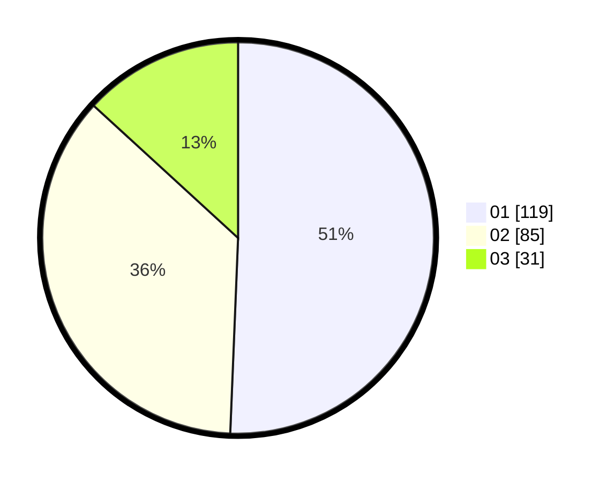

# Hasil

Hasil perolehan suara paslon dapat dilihat pada file paslon-01.txt, paslon-02.txt, dan paslon-03.txt.

Jika tidak ada, artinya data tersebut belum ada pada SIREKAP.

## Perolehan Suara

 * Paslon 01: **119**.
 * Paslon 02: **85**.
 * Paslon 03: **31**.

## Foto C Plano

https://sirekap-obj-formc.kpu.go.id/4370/pemilu/ppwp/31/75/03/10/07/3175031007104-20240218-123301--8cd7aede-52dd-4a76-b6aa-1b5f975145b7.jpg

https://sirekap-obj-formc.kpu.go.id/4370/pemilu/ppwp/31/75/03/10/07/3175031007104-20240215-170739--7e018620-af70-47b7-9c4d-d5efce2ae103.jpg

https://sirekap-obj-formc.kpu.go.id/4370/pemilu/ppwp/31/75/03/10/07/3175031007104-20240215-170915--039c19c9-8eee-4f6e-ae94-996864e962a7.jpg
