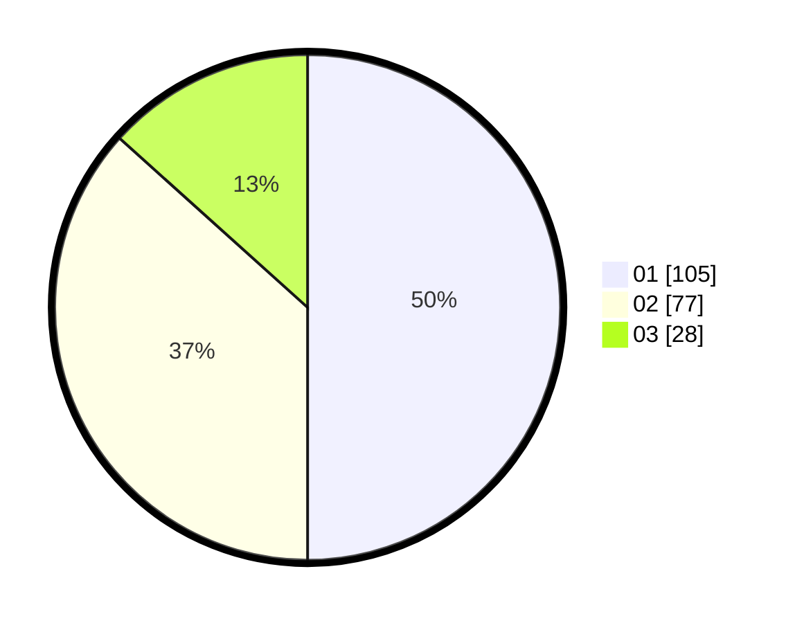

# Hasil

Hasil perolehan suara paslon dapat dilihat pada file paslon-01.txt, paslon-02.txt, dan paslon-03.txt.

Jika tidak ada, artinya data tersebut belum ada pada SIREKAP.

## Perolehan Suara

 * Paslon 01: **105**.
 * Paslon 02: **77**.
 * Paslon 03: **28**.

## Foto C Plano

https://sirekap-obj-formc.kpu.go.id/c527/pemilu/ppwp/31/75/03/10/07/3175031007109-20240215-023021--58de95ad-4500-4d79-bb4c-23b93fa9141d.jpg

https://sirekap-obj-formc.kpu.go.id/c527/pemilu/ppwp/31/75/03/10/07/3175031007109-20240215-023049--80bd2b4a-5247-4034-bb78-2c53efb88a28.jpg

https://sirekap-obj-formc.kpu.go.id/c527/pemilu/ppwp/31/75/03/10/07/3175031007109-20240216-223121--7646329a-c277-4123-8326-5ac8f8839031.jpg

## DATA PEMILIH TETAP

Jumlah pemilih dalam DPT: **266**.
 * L: **127**.
 * P: **139**.

## DATA PENGGUNA HAK PILIH

Jumlah pengguna hak pilih dalam DPT: **196**.
 * L: **87**.
 * P: **109**.

Jumlah pengguna hak pilih dalam DPTb: **14**.
 * L: **9**.
 * P: **5**.

Jumlah pengguna hak pilih dalam DPK: **2**.
 * L: **1**.
 * P: **1**.

Jumlah pengguna hak pilih: **212**.
 * L: **94**.
 * P: **115**.

## JUMLAH SUARA SAH DAN TIDAK SAH

JUMLAH SELURUH SUARA SAH: **210**.

JUMLAH SUARA TIDAK SAH: **2**.

JUMLAH SELURUH SUARA SAH DAN SUARA TIDAK SAH: **212**.
