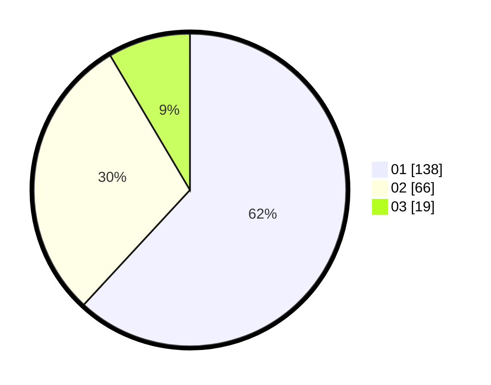

# Hasil

Hasil perolehan suara paslon dapat dilihat pada file paslon-01.txt, paslon-02.txt, dan paslon-03.txt.

Jika tidak ada, artinya data tersebut belum ada pada SIREKAP.

## Perolehan Suara

 * Paslon 01: **138**.
 * Paslon 02: **66**.
 * Paslon 03: **19**.

## Foto C Plano

https://sirekap-obj-formc.kpu.go.id/3184/pemilu/ppwp/31/75/03/10/07/3175031007115-20240216-093747--2361d2ad-05ea-455d-b378-81e3953a25b3.jpg

https://sirekap-obj-formc.kpu.go.id/3184/pemilu/ppwp/31/75/03/10/07/3175031007115-20240216-094558--31bae4c8-6ea6-453c-8f84-a919f792119f.jpg

https://sirekap-obj-formc.kpu.go.id/3184/pemilu/ppwp/31/75/03/10/07/3175031007115-20240216-095146--2f5a4d1d-ac45-4d0e-aa65-44cdf06128cb.jpg

## DATA PEMILIH TETAP

Jumlah pemilih dalam DPT: **259**.
 * L: **139**.
 * P: **120**.

## DATA PENGGUNA HAK PILIH

Jumlah pengguna hak pilih dalam DPT: **209**.
 * L: **110**.
 * P: **99**.

Jumlah pengguna hak pilih dalam DPTb: **15**.
 * L: **7**.
 * P: **8**.

Jumlah pengguna hak pilih dalam DPK: **3**.
 * L: **2**.
 * P: **1**.

Jumlah pengguna hak pilih: **227**.
 * L: **119**.
 * P: **108**.

## JUMLAH SUARA SAH DAN TIDAK SAH

JUMLAH SELURUH SUARA SAH: **223**.

JUMLAH SUARA TIDAK SAH: **4**.

JUMLAH SELURUH SUARA SAH DAN SUARA TIDAK SAH: **227**.
