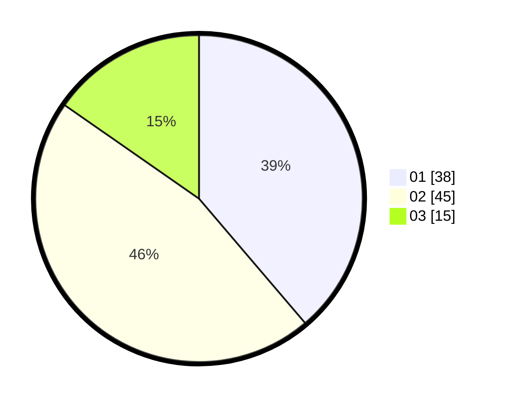

# Hasil

Hasil perolehan suara paslon dapat dilihat pada file paslon-01.txt, paslon-02.txt, dan paslon-03.txt.

Jika tidak ada, artinya data tersebut belum ada pada SIREKAP.

## Perolehan Suara

 * Paslon 01: **38**.
 * Paslon 02: **45**.
 * Paslon 03: **15**.

## Foto C Plano

https://sirekap-obj-formc.kpu.go.id/4b57/pemilu/ppwp/31/75/03/10/07/3175031007902-20240214-192945--c4dcec7a-a2f8-48cc-b603-d17a00b6ab3e.jpg

https://sirekap-obj-formc.kpu.go.id/4b57/pemilu/ppwp/31/75/03/10/07/3175031007902-20240214-193011--2c08d1a1-0271-46c9-bba0-9c8dc81f6218.jpg

https://sirekap-obj-formc.kpu.go.id/4b57/pemilu/ppwp/31/75/03/10/07/3175031007902-20240214-193030--03f6bd7c-524c-4657-94f1-25c4160757d9.jpg

## DATA PEMILIH TETAP

Jumlah pemilih dalam DPT: **197**.
 * L: **117**.
 * P: **80**.

## DATA PENGGUNA HAK PILIH

Jumlah pengguna hak pilih dalam DPT: **78**.
 * L: **44**.
 * P: **34**.

Jumlah pengguna hak pilih dalam DPTb: **19**.
 * L: **13**.
 * P: **6**.

Jumlah pengguna hak pilih dalam DPK: **2**.
 * L: **0**.
 * P: **2**.

Jumlah pengguna hak pilih: **99**.
 * L: **57**.
 * P: **42**.

## JUMLAH SUARA SAH DAN TIDAK SAH

JUMLAH SELURUH SUARA SAH: **98**.

JUMLAH SUARA TIDAK SAH: **1**.

JUMLAH SELURUH SUARA SAH DAN SUARA TIDAK SAH: **99**.
