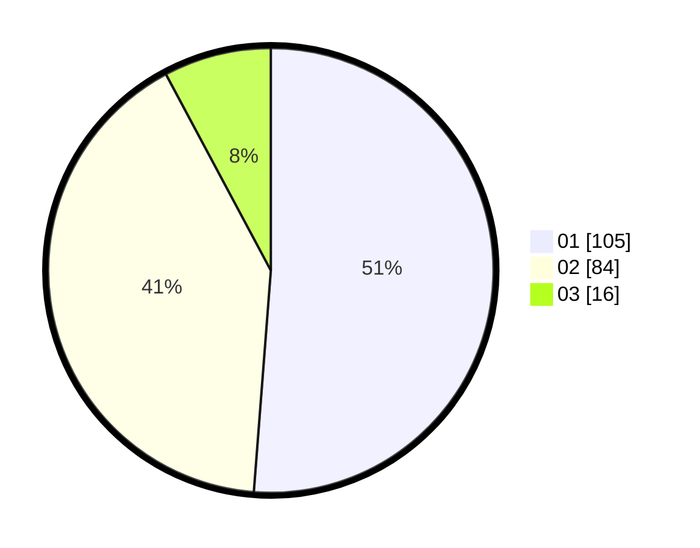

# Hasil

Hasil perolehan suara paslon dapat dilihat pada file paslon-01.txt, paslon-02.txt, dan paslon-03.txt.

Jika tidak ada, artinya data tersebut belum ada pada SIREKAP.

## Perolehan Suara

 * Paslon 01: **105**.
 * Paslon 02: **84**.
 * Paslon 03: **16**.

## Foto C Plano

https://sirekap-obj-formc.kpu.go.id/73ae/pemilu/ppwp/31/75/03/10/08/3175031008006-20240216-082540--ba9c51e9-a835-4fcc-b9f4-8a8938bdeeb3.jpg

https://sirekap-obj-formc.kpu.go.id/73ae/pemilu/ppwp/31/75/03/10/08/3175031008006-20240216-082542--b2c0a0e0-7cdb-41c4-b438-9c4f2118fa7c.jpg

https://sirekap-obj-formc.kpu.go.id/73ae/pemilu/ppwp/31/75/03/10/08/3175031008006-20240216-082541--98f0bac7-2ba6-4912-901a-9a396cd749ac.jpg

## DATA PEMILIH TETAP

Jumlah pemilih dalam DPT: **274**.
 * L: **144**.
 * P: **130**.

## DATA PENGGUNA HAK PILIH

Jumlah pengguna hak pilih dalam DPT: **210**.
 * L: **105**.
 * P: **105**.

Jumlah pengguna hak pilih dalam DPTb: **1**.
 * L: **1**.
 * P: **0**.

Jumlah pengguna hak pilih dalam DPK: **0**.
 * L: **0**.
 * P: **0**.

Jumlah pengguna hak pilih: **211**.
 * L: **106**.
 * P: **105**.

## JUMLAH SUARA SAH DAN TIDAK SAH

JUMLAH SELURUH SUARA SAH: **205**.

JUMLAH SUARA TIDAK SAH: **6**.

JUMLAH SELURUH SUARA SAH DAN SUARA TIDAK SAH: **211**.
