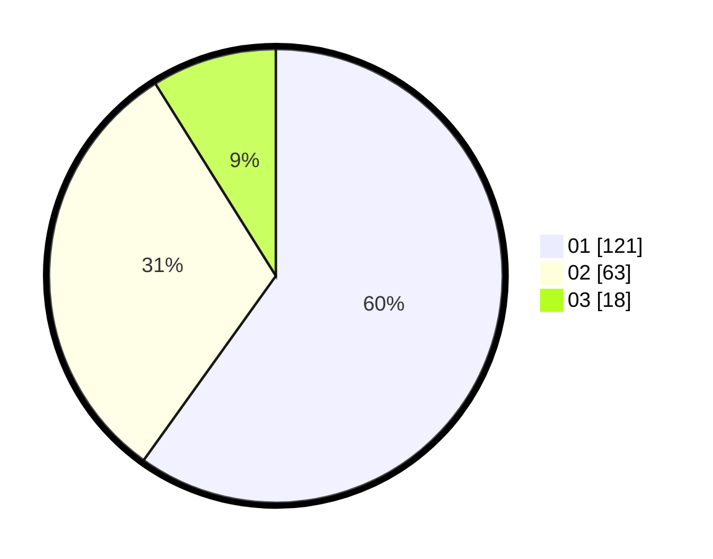

# Hasil

Hasil perolehan suara paslon dapat dilihat pada file paslon-01.txt, paslon-02.txt, dan paslon-03.txt.

Jika tidak ada, artinya data tersebut belum ada pada SIREKAP.

## Perolehan Suara

 * Paslon 01: **121**.
 * Paslon 02: **63**.
 * Paslon 03: **18**.

## Foto C Plano

https://sirekap-obj-formc.kpu.go.id/7b52/pemilu/ppwp/31/75/03/10/08/3175031008007-20240214-214414--7344adbe-0a66-479f-9985-7450c793c3bf.jpg

https://sirekap-obj-formc.kpu.go.id/7b52/pemilu/ppwp/31/75/03/10/08/3175031008007-20240214-194922--75470950-07f9-45fc-a4c1-56482dbf64d7.jpg

https://sirekap-obj-formc.kpu.go.id/7b52/pemilu/ppwp/31/75/03/10/08/3175031008007-20240214-195116--4a3e8d7e-a26b-4285-906e-030b7b8dca9c.jpg
