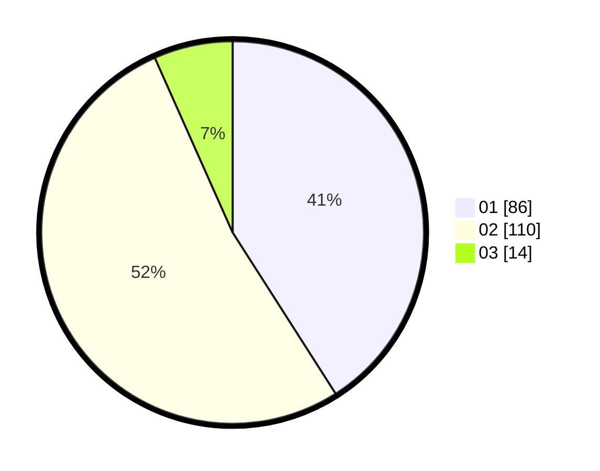

# Hasil

Hasil perolehan suara paslon dapat dilihat pada file paslon-01.txt, paslon-02.txt, dan paslon-03.txt.

Jika tidak ada, artinya data tersebut belum ada pada SIREKAP.

## Perolehan Suara

 * Paslon 01: **86**.
 * Paslon 02: **110**.
 * Paslon 03: **14**.

## Foto C Plano

https://sirekap-obj-formc.kpu.go.id/b872/pemilu/ppwp/31/75/03/10/08/3175031008008-20240216-134115--979af1d4-eadd-468b-87b0-3984fb9d2368.jpg

https://sirekap-obj-formc.kpu.go.id/b872/pemilu/ppwp/31/75/03/10/08/3175031008008-20240216-134117--42184e66-d952-468a-8d5c-9a0ab571e1bf.jpg

https://sirekap-obj-formc.kpu.go.id/b872/pemilu/ppwp/31/75/03/10/08/3175031008008-20240216-134116--0197851b-f314-49b6-8f0d-292e21c31123.jpg

## DATA PEMILIH TETAP

Jumlah pemilih dalam DPT: **280**.
 * L: **147**.
 * P: **133**.

## DATA PENGGUNA HAK PILIH

Jumlah pengguna hak pilih dalam DPT: **221**.
 * L: **117**.
 * P: **104**.

Jumlah pengguna hak pilih dalam DPTb: **0**.
 * L: **0**.
 * P: **0**.

Jumlah pengguna hak pilih dalam DPK: **0**.
 * L: **0**.
 * P: **0**.

Jumlah pengguna hak pilih: **221**.
 * L: **117**.
 * P: **104**.

## JUMLAH SUARA SAH DAN TIDAK SAH

JUMLAH SELURUH SUARA SAH: **210**.

JUMLAH SUARA TIDAK SAH: **11**.

JUMLAH SELURUH SUARA SAH DAN SUARA TIDAK SAH: **221**.
