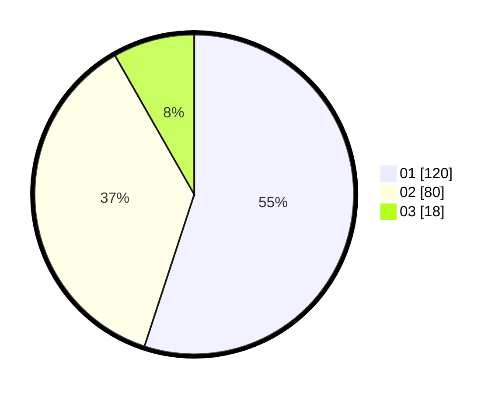

# Hasil

Hasil perolehan suara paslon dapat dilihat pada file paslon-01.txt, paslon-02.txt, dan paslon-03.txt.

Jika tidak ada, artinya data tersebut belum ada pada SIREKAP.

## Perolehan Suara

 * Paslon 01: **120**.
 * Paslon 02: **80**.
 * Paslon 03: **18**.

## Foto C Plano

https://sirekap-obj-formc.kpu.go.id/367b/pemilu/ppwp/31/75/03/10/08/3175031008010-20240215-015011--cbf865dd-4e60-4079-8416-ab30d7d060bc.jpg

https://sirekap-obj-formc.kpu.go.id/367b/pemilu/ppwp/31/75/03/10/08/3175031008010-20240215-012104--6099fa1e-9146-497e-a0a0-e59b200b5a5c.jpg

https://sirekap-obj-formc.kpu.go.id/367b/pemilu/ppwp/31/75/03/10/08/3175031008010-20240215-012154--687320b2-0dd7-4422-8943-4315ceb47779.jpg
