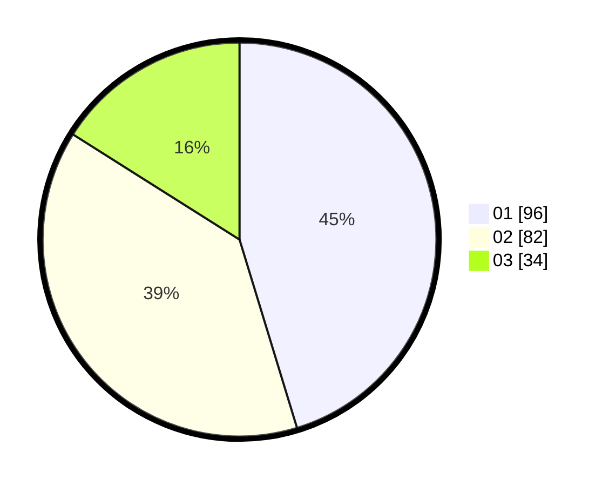

# Hasil

Hasil perolehan suara paslon dapat dilihat pada file paslon-01.txt, paslon-02.txt, dan paslon-03.txt.

Jika tidak ada, artinya data tersebut belum ada pada SIREKAP.

## Perolehan Suara

 * Paslon 01: **96**.
 * Paslon 02: **82**.
 * Paslon 03: **34**.

## Foto C Plano

https://sirekap-obj-formc.kpu.go.id/a690/pemilu/ppwp/31/75/03/10/08/3175031008019-20240214-225348--8e0194aa-db7b-402a-9b26-d992c01db721.jpg

https://sirekap-obj-formc.kpu.go.id/a690/pemilu/ppwp/31/75/03/10/08/3175031008019-20240215-023947--8f665106-7c6a-4b7c-a2e2-b2c4daf7eb8e.jpg

https://sirekap-obj-formc.kpu.go.id/a690/pemilu/ppwp/31/75/03/10/08/3175031008019-20240214-225401--606ef4a2-5721-476b-9382-f712a80d3bcc.jpg

## DATA PEMILIH TETAP

Jumlah pemilih dalam DPT: **273**.
 * L: **140**.
 * P: **133**.

## DATA PENGGUNA HAK PILIH

Jumlah pengguna hak pilih dalam DPT: **218**.
 * L: **106**.
 * P: **112**.

Jumlah pengguna hak pilih dalam DPTb: **1**.
 * L: **1**.
 * P: **0**.

Jumlah pengguna hak pilih dalam DPK: **0**.
 * L: **0**.
 * P: **0**.

Jumlah pengguna hak pilih: **219**.
 * L: **107**.
 * P: **112**.

## JUMLAH SUARA SAH DAN TIDAK SAH

JUMLAH SELURUH SUARA SAH: **212**.

JUMLAH SUARA TIDAK SAH: **7**.

JUMLAH SELURUH SUARA SAH DAN SUARA TIDAK SAH: **219**.
