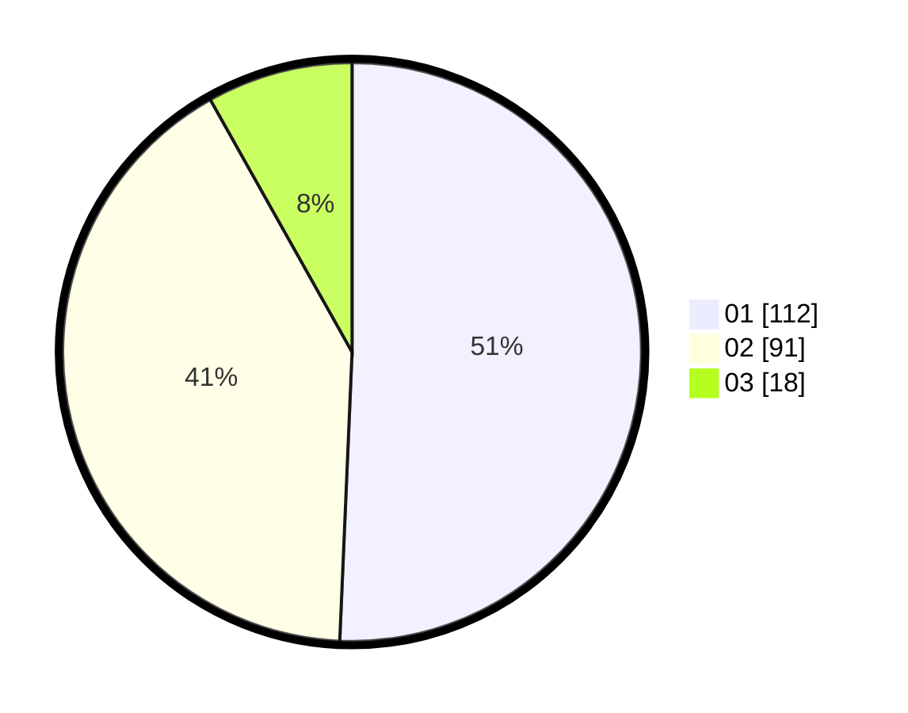

# Hasil

Hasil perolehan suara paslon dapat dilihat pada file paslon-01.txt, paslon-02.txt, dan paslon-03.txt.

Jika tidak ada, artinya data tersebut belum ada pada SIREKAP.

## Perolehan Suara

 * Paslon 01: **112**.
 * Paslon 02: **91**.
 * Paslon 03: **18**.

## Foto C Plano

https://sirekap-obj-formc.kpu.go.id/907e/pemilu/ppwp/31/75/03/10/08/3175031008020-20240216-123029--588e88b5-d969-4c65-b2cf-52fa3590b4a7.jpg

https://sirekap-obj-formc.kpu.go.id/907e/pemilu/ppwp/31/75/03/10/08/3175031008020-20240216-123046--6ea08f70-f099-4594-bfbb-ba504d7cd3a2.jpg

https://sirekap-obj-formc.kpu.go.id/907e/pemilu/ppwp/31/75/03/10/08/3175031008020-20240216-123038--5e0e8706-0d1b-497b-b3a4-39ce15335eaa.jpg

## DATA PEMILIH TETAP

Jumlah pemilih dalam DPT: **277**.
 * L: **145**.
 * P: **132**.

## DATA PENGGUNA HAK PILIH

Jumlah pengguna hak pilih dalam DPT: **222**.
 * L: **114**.
 * P: **108**.

Jumlah pengguna hak pilih dalam DPTb: **0**.
 * L: **0**.
 * P: **0**.

Jumlah pengguna hak pilih dalam DPK: **4**.
 * L: **2**.
 * P: **2**.

Jumlah pengguna hak pilih: **226**.
 * L: **116**.
 * P: **110**.

## JUMLAH SUARA SAH DAN TIDAK SAH

JUMLAH SELURUH SUARA SAH: **221**.

JUMLAH SUARA TIDAK SAH: **5**.

JUMLAH SELURUH SUARA SAH DAN SUARA TIDAK SAH: **226**.
