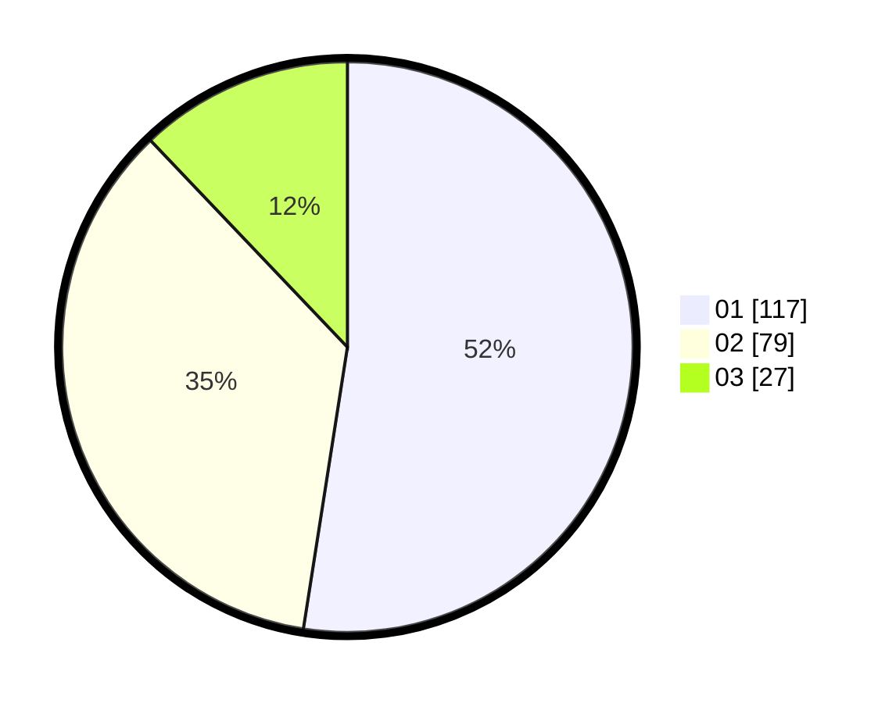

# Hasil

Hasil perolehan suara paslon dapat dilihat pada file paslon-01.txt, paslon-02.txt, dan paslon-03.txt.

Jika tidak ada, artinya data tersebut belum ada pada SIREKAP.

## Perolehan Suara

 * Paslon 01: **117**.
 * Paslon 02: **79**.
 * Paslon 03: **27**.

## Foto C Plano

https://sirekap-obj-formc.kpu.go.id/5a79/pemilu/ppwp/31/75/03/10/08/3175031008021-20240215-000415--668ee640-7d81-4c08-bd4c-db8f76753d7a.jpg

https://sirekap-obj-formc.kpu.go.id/5a79/pemilu/ppwp/31/75/03/10/08/3175031008021-20240215-000420--cc9d5761-1b1f-451c-a601-9a4b3f32e631.jpg

https://sirekap-obj-formc.kpu.go.id/5a79/pemilu/ppwp/31/75/03/10/08/3175031008021-20240215-000441--054d89e8-39c5-437a-a2e5-bffd488fcc04.jpg
