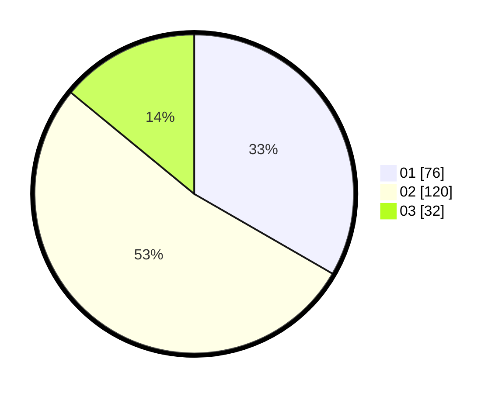

# Hasil

Hasil perolehan suara paslon dapat dilihat pada file paslon-01.txt, paslon-02.txt, dan paslon-03.txt.

Jika tidak ada, artinya data tersebut belum ada pada SIREKAP.

## Perolehan Suara

 * Paslon 01: **76**.
 * Paslon 02: **120**.
 * Paslon 03: **32**.

## Foto C Plano

https://sirekap-obj-formc.kpu.go.id/e916/pemilu/ppwp/31/75/03/10/08/3175031008023-20240215-030243--ab3bb682-c71e-4a2f-98dc-a86245092dcd.jpg

https://sirekap-obj-formc.kpu.go.id/e916/pemilu/ppwp/31/75/03/10/08/3175031008023-20240214-193318--f46798c2-6499-4833-a4aa-565dccae31d3.jpg

https://sirekap-obj-formc.kpu.go.id/e916/pemilu/ppwp/31/75/03/10/08/3175031008023-20240214-193330--56b4a7cf-04b2-48c7-a62a-dd23d9aa5edf.jpg

## DATA PEMILIH TETAP

Jumlah pemilih dalam DPT: **273**.
 * L: **140**.
 * P: **133**.

## DATA PENGGUNA HAK PILIH

Jumlah pengguna hak pilih dalam DPT: **228**.
 * L: **117**.
 * P: **111**.

Jumlah pengguna hak pilih dalam DPTb: **1**.
 * L: **0**.
 * P: **1**.

Jumlah pengguna hak pilih dalam DPK: **3**.
 * L: **2**.
 * P: **1**.

Jumlah pengguna hak pilih: **232**.
 * L: **119**.
 * P: **113**.

## JUMLAH SUARA SAH DAN TIDAK SAH

JUMLAH SELURUH SUARA SAH: **228**.

JUMLAH SUARA TIDAK SAH: **4**.

JUMLAH SELURUH SUARA SAH DAN SUARA TIDAK SAH: **232**.
