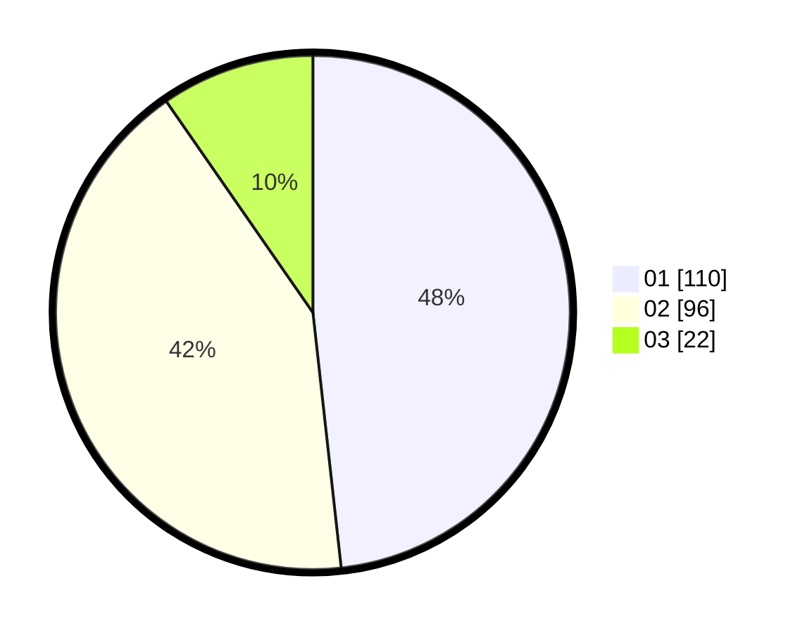

# Hasil

Hasil perolehan suara paslon dapat dilihat pada file paslon-01.txt, paslon-02.txt, dan paslon-03.txt.

Jika tidak ada, artinya data tersebut belum ada pada SIREKAP.

## Perolehan Suara

 * Paslon 01: **110**.
 * Paslon 02: **96**.
 * Paslon 03: **22**.

## Foto C Plano

https://sirekap-obj-formc.kpu.go.id/ee8e/pemilu/ppwp/31/75/03/10/08/3175031008024-20240216-213817--ad83c424-95d5-41f6-9b88-92813156bd7c.jpg

https://sirekap-obj-formc.kpu.go.id/ee8e/pemilu/ppwp/31/75/03/10/08/3175031008024-20240216-213819--cefd5ac8-b608-447d-bbd9-3df957feea24.jpg

https://sirekap-obj-formc.kpu.go.id/ee8e/pemilu/ppwp/31/75/03/10/08/3175031008024-20240216-213818--064db24a-a407-447c-8f48-4cf94753f538.jpg

## DATA PEMILIH TETAP

Jumlah pemilih dalam DPT: **283**.
 * L: **141**.
 * P: **142**.

## DATA PENGGUNA HAK PILIH

Jumlah pengguna hak pilih dalam DPT: **234**.
 * L: **117**.
 * P: **117**.

Jumlah pengguna hak pilih dalam DPTb: **0**.
 * L: **0**.
 * P: **0**.

Jumlah pengguna hak pilih dalam DPK: **0**.
 * L: **0**.
 * P: **0**.

Jumlah pengguna hak pilih: **234**.
 * L: **117**.
 * P: **117**.

## JUMLAH SUARA SAH DAN TIDAK SAH

JUMLAH SELURUH SUARA SAH: **228**.

JUMLAH SUARA TIDAK SAH: **6**.

JUMLAH SELURUH SUARA SAH DAN SUARA TIDAK SAH: **234**.
