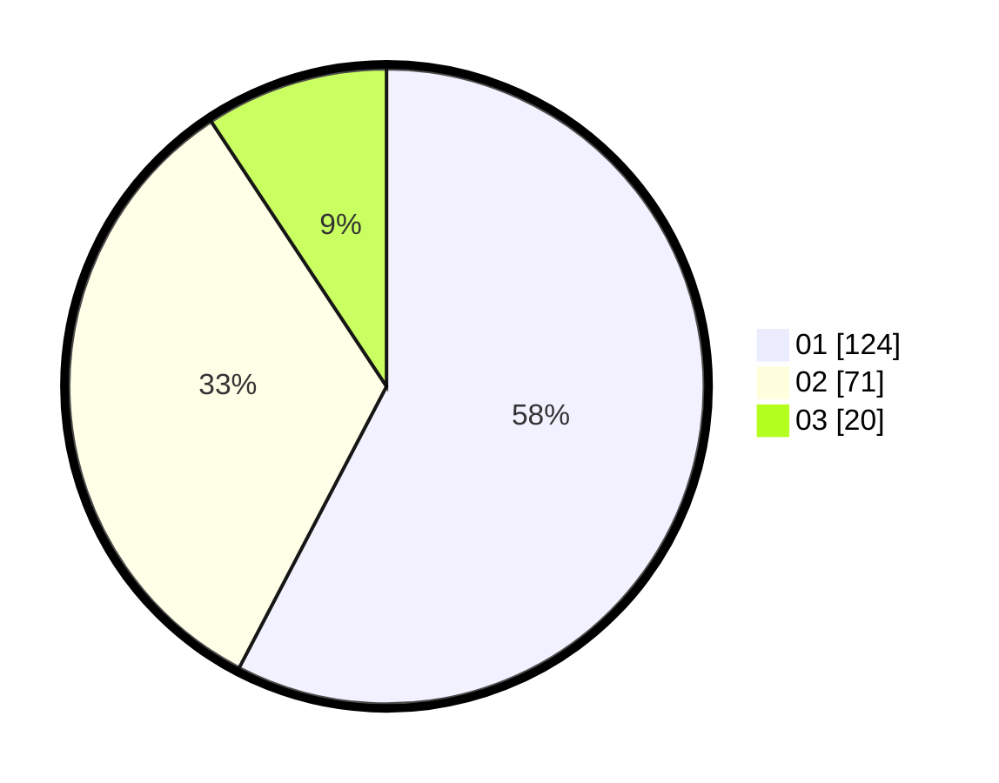

# Hasil

Hasil perolehan suara paslon dapat dilihat pada file paslon-01.txt, paslon-02.txt, dan paslon-03.txt.

Jika tidak ada, artinya data tersebut belum ada pada SIREKAP.

## Perolehan Suara

 * Paslon 01: **124**.
 * Paslon 02: **71**.
 * Paslon 03: **20**.

## Foto C Plano

https://sirekap-obj-formc.kpu.go.id/681d/pemilu/ppwp/31/75/03/10/08/3175031008027-20240216-015631--429aab2e-93ab-4be6-9318-c9cefd34a849.jpg

https://sirekap-obj-formc.kpu.go.id/681d/pemilu/ppwp/31/75/03/10/08/3175031008027-20240214-200139--8b51bb14-5360-4ffe-a6a6-fede82c990d8.jpg

https://sirekap-obj-formc.kpu.go.id/681d/pemilu/ppwp/31/75/03/10/08/3175031008027-20240214-200238--58917cdd-c823-4447-97ce-e879d878a4b9.jpg

## DATA PEMILIH TETAP

Jumlah pemilih dalam DPT: **275**.
 * L: **138**.
 * P: **137**.

## DATA PENGGUNA HAK PILIH

Jumlah pengguna hak pilih dalam DPT: **214**.
 * L: **106**.
 * P: **108**.

Jumlah pengguna hak pilih dalam DPTb: **0**.
 * L: **0**.
 * P: **0**.

Jumlah pengguna hak pilih dalam DPK: **2**.
 * L: **0**.
 * P: **2**.

Jumlah pengguna hak pilih: **0**.
 * L: **0**.
 * P: **0**.

## JUMLAH SUARA SAH DAN TIDAK SAH

JUMLAH SELURUH SUARA SAH: **215**.

JUMLAH SUARA TIDAK SAH: **1**.

JUMLAH SELURUH SUARA SAH DAN SUARA TIDAK SAH: **216**.
